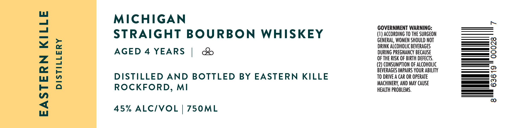

# TTB COLA Label Images - TTBID 26071001000726

**Brand Name:** EASTERN KILLE DISTILLERY

**Issue Date:** 03/13/2026

**Origin Code:** 06

**Product Class/Type:** 101

**Source:** [TTB Public COLA Registry](https://ttbonline.gov/colasonline/viewColaDetails.do?action=publicFormDisplay&ttbid=26071001000726)

## Label Images

### Label 1

## Extracted Label Text

*Text extracted via OCR - may contain errors*

**Detected Proof:** 90
**Detected Age:** 4 Years

### Label 1

EASTERN KILLE

DISTILLERY

MICHIGAN
STRAIGHT BOURBON WHISKEY
AGED 4 YEARS | &

DISTILLED AND BOTTLED BY EASTERN KILLE
ROCKFORD, MI

45% ALC/VOL | 750ML

GOVERNMENT WARNING:
(1) ACCORDING TO THE SURGEON
GENERAL, WOMEN SHOULD NOT
DRINK ALCOHOLIC BEVERAGES
DURING PREGNANCY BECAUSE
OF THE RISK OF BIRTH DEFECTS.
(2) CONSUMPTION OF ALCOHOLIC
BEVERAGES IMPAIRS YOUR ABILITY
TO DRIVE A CAR OR OPERATE
MACHINERY, AND MAY CAUSE
HEALTH PROBLEMS.

ri

00028

lll

8
