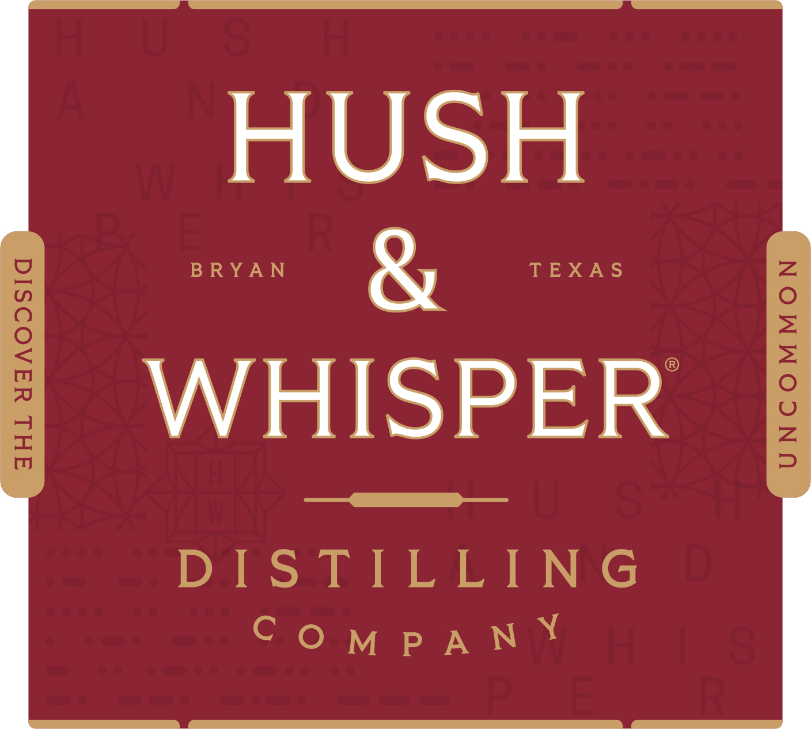
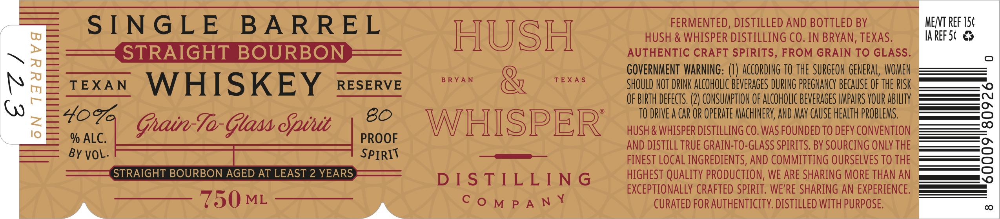
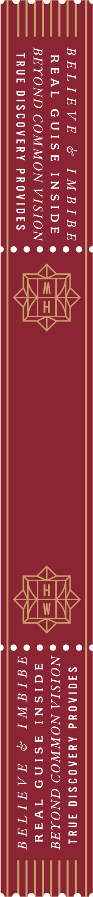

# TTB COLA Label Images - TTBID 26071001000727

**Brand Name:** HUSH & WHISPER

**Issue Date:** 03/16/2026

**Origin Code:** 44

**Product Class/Type:** 101

**Source:** [TTB Public COLA Registry](https://ttbonline.gov/colasonline/viewColaDetails.do?action=publicFormDisplay&ttbid=26071001000727)

## Label Images

### Label 1

### Label 2

### Label 3

## Extracted Label Text

*Text extracted via OCR - may contain errors*

*1 image(s) excluded: text did not meet readability threshold*

**Detected Age:** 2 Years

### Label 2

HUSH & WHISPER DISTILLING CO. IN BRYAN, TEXAS

SINGLE BARREL HUSH FERMENTED, DISTILLED AND BOTTLED BY

w
>
a
a
m
a
Zz
10

PROOF

STRAIGHT BOURBON AUTHENTIC CRAFT SPIRITS, FROM GRAIN TO GLASS.

TV = Ae GOVERNMENT WARNING: (1) ACCORDING TO THE SURGEON GENERAL
TEXAN WHISKEY eeserve  ***" T=x*S SHOULD NOT DRINK ALCOHOLIC BEVERAGES DURING PREGNANCY BECAUSE OF THE RISK
Aaa Se, OF BIRTH DEFECTS. (2) CONSUMPTION O ALCOHOLIC BEVERAGES IPRS YOUR ABILITY
OX

; Roe 80 i TO DRIVE A CAR OR OPERATE MACHINERY, AND MAY CAUSE HEALTH PROBLEMS.
Ghatrr-1a- Glass Sut WH IS PER HUSH & WHISPER DISTILLING CO. WAS FOUNDED TO DEFY CONVENTION SSS

OMEN

6

arnt AND DISTILL TRUE GRAIN-TO-GLASS SPIRITS. BY SOURCING ONLY THE
PIRY FINEST LOCAL INGREDIENTS, AND COMMITTING OURSELVES TO THE

STRAIGHT BOURBON AGED AT LEAST 2 YEARS

EXCEPTIONALLY CRAFTED SPIRIT. WE'RE SHARING AN EXPERIE
COMPANY CURATED FOR AUTHENTICITY. DISTILLED WITH PURPOSE.

DLS 1_L-—IN/G HIGHEST QUALITY PRODUCTION, WE ARE SHARING MORE THAN AN 7
C=

### Label 3

BELIEVE & IMBIBE¢ AS SIGIANONd AYIAOISIO 3NYL
REAL GUISE INSIDE e ash e NOISIA NOWWOD GNOLAI

BEYOND COMMON VISION ® Yay @ 3qGISNI aSIND Iva"
TRUE DISCOVERY PROVIDES << star awi ® AAHITAG
