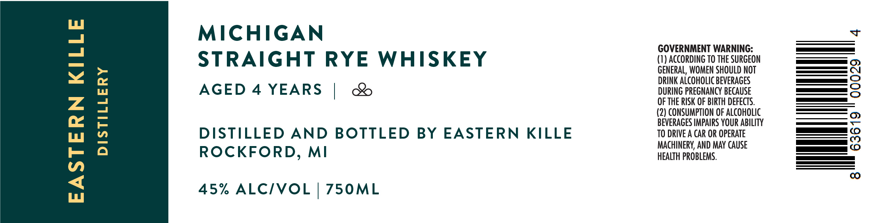

# TTB COLA Label Images - TTBID 26071001000730

**Brand Name:** EASTERN KILLE DISTILLERY

**Issue Date:** 03/13/2026

**Origin Code:** 06

**Product Class/Type:** 102

**Source:** [TTB Public COLA Registry](https://ttbonline.gov/colasonline/viewColaDetails.do?action=publicFormDisplay&ttbid=26071001000730)

## Label Images

### Label 1

## Extracted Label Text

*Text extracted via OCR - may contain errors*

**Detected Proof:** 90
**Detected Age:** 4 Years

### Label 1

MICHIGAN

GOVERNMENT WARNING:

STRAIGHT RYE WHISKEY

(1) ACCORDING TO THE SURGEON

es

GENERAL, WOMEN SHOULD NOT

DRINK ALCOHOLIC BEVERAGES

—

&

DURING PREGNANCY BECAUSE

—a_ —

AGED 4 YEARS |

OF THE RISK OF BIRTH DEFECTS.

(2) CONSUMPTION OF ALCOH

BEVERAGES IMPAIRS YOUR ABILITY

<_< ~—

DISTILLED AND BOTTLED BY EASTERN KILLE

TO DRIVE A CAR OR OPERATE

es

MACHINERY, AND MAY CAUSE

ee

ee

ROCKFORD, MI

HEALTH PROBLEMS.

45% ALC/VOL | 750ML
