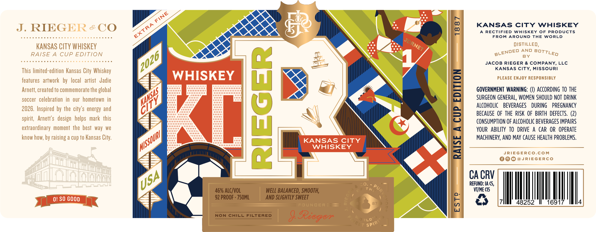
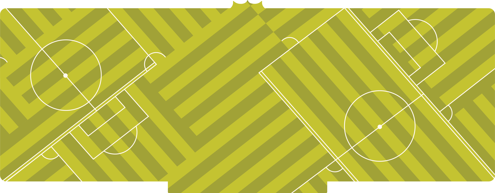

# TTB COLA Label Images - TTBID 26071001000831

**Brand Name:** RIEGER

**Fanciful Name:** KANSAS CITY WHISKEY WORLD CUP EDITION

**Issue Date:** 03/13/2026

**Origin Code:** 29

**Product Class/Type:** 140

**Source:** [TTB Public COLA Registry](https://ttbonline.gov/colasonline/viewColaDetails.do?action=publicFormDisplay&ttbid=26071001000831)

## Label Images

### Front Label

### Label 2

### Label 3

## Extracted Label Text

*Text extracted via OCR - may contain errors*

*1 image(s) excluded: text did not meet readability threshold*

**Detected Proof:** 92

### Front Label

J.RIEGER &CO
8
KANSAS CITY
WHISKEY
RECTIFIED WAISKEY
OF PRODUCTS
FROM AROUND
THE WORLD
KAnSAS CITY WHISKEY
dIsTILLEd
AND
RAISE A
CUP EDITION
BY
1
JACOB RIEGER
& COMPANY, LLC
KANSAS City
MISSOURI
This limited-edition Kansas City Whiskey
features   artwork  by   local   artist   Jadie
WHISKEY
PLEASE ENJOY RESPONSIBLY
Arnett; created to commemorate the global
1
GOVERNMENT WARNING: (U) ACcORdINg To THE
soccer   celebration  in
ourhometown  in
SURGEON GENERAL; WOMEN SHOULD NOT  DRINK
2026. Inspired by the  city'$ energy and
1
8
AECAHGE OF BEVE RGE OPURRUG DEREGMAMCy
spirit,  Arnetf's   design   helps   mark this
CONSUMPTION OF ALCOHOLIC BEVERAGES IMPAIRS
extraordinary  moment the best  way
we
YOUR   ABILITY  TO   DRIVE
A CAR OR  OPERATE
know
by raising a cup to Kansas City:
KANSAS CITY
MAchineRV, AND May CAUSE HEALTH PROBLEMS.
WHISKEY
1
JRIEGERCO.COM
@JRIEGERCO
CA CRV
REFUND: IA (5,
46% ALC/VOL
WELL BALANCED, SMOOTH;
Th
VTIME (15
0! SO GOOD
92 PROOF . 75OML
AND SLIghTLY SWEET
FOUNDER
87
5
E
48252
1691
4
NON
CHILL FILTERED
9
OrLd"
8at
FINE
EXTRA
JDRNET
BLENDED
BOTTLED
72026
TiS4
(
[MISSoURI}
how; !
USA;
Purt
@
dRivrergrerr
SPIRIT

### Label 3

Z88L

gis3

Oo! so GooD J. RIEGER & CO. EXTRA FINE

== KANSAS CITY WHISKEY - =

EXTRA FINE KANSAS CITY : MISSOURI Oo: so Goood

2.
e
a
we

1887
