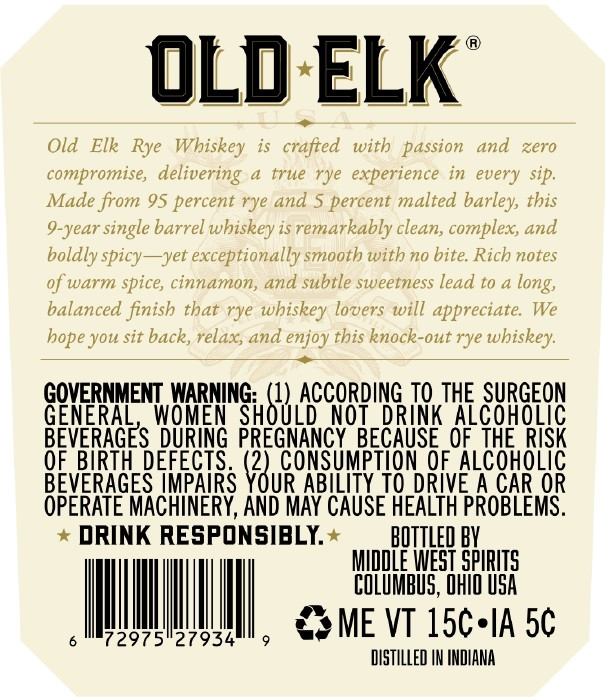
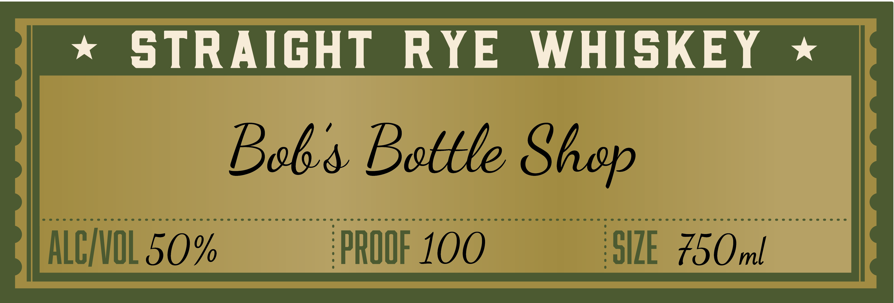

# TTB COLA Label Images - TTBID 26071001000980

**Brand Name:** OLD ELK

**Issue Date:** 03/23/2026

**Origin Code:** 09

**Product Class/Type:** 102

**Source:** [TTB Public COLA Registry](https://ttbonline.gov/colasonline/viewColaDetails.do?action=publicFormDisplay&ttbid=26071001000980)

## Label Images

### Back Label

### Front Label

### Label 3

## Extracted Label Text

*Text extracted via OCR - may contain errors*

*1 image(s) excluded: text did not meet readability threshold*

**Detected Proof:** 100

### Back Label

, 1 ®
OLD ELK
i
al oes
Old Elk Rye Whiskey is crafted with passion and zero
compromise, delivering a true rye experience in every sip.
Made from 95 percent rye and 5 percent malted barley, this
9-year single barrel whiskey is remarkably clean, complex, and
boldly spicy—yet exceptionally smooth with no bite. Rich notes
of warm spice, cinnamon, and subtle sweetness lead to a long
balanced finish that rye whiskey lovers will appreciate. We
hope you sit back, relax, and enjoy this knock-out rye whiskey
GOVERNMENT WARNING. (1) ACCORDING TO THE SURGEON
GENERAL, WOMEN SHOULD NOT DRINK ALCOHOLIC
BEVERAGES DURING PREGNANCY BECAUSE OF THE RISK
OF BIRTH DEFECTS. "a CONSUMPTION OF ALCOHOLIC
BEVERAGES IMPAIRS YOUR ABILITY TO DRIVE A CAR OR
OPERATE MACHINERY, AND MAY CAUSE HEALTH PROBLEMS.
* DRINK RESPONSIBLY. —_ BOTTLED BY
MIDDLE WEST SPIRITS
IM, csne'vrisc-n
”
oMrasrsieryseel, SOME VT 1SCsIA 5¢
DISTILLED IN INDIANA

### Front Label

STRAIGHT
R YE
WHISKEY
Boks Bottle
ALCIVOL 50%
PROOF 100
SIZE  750ml
Shep
