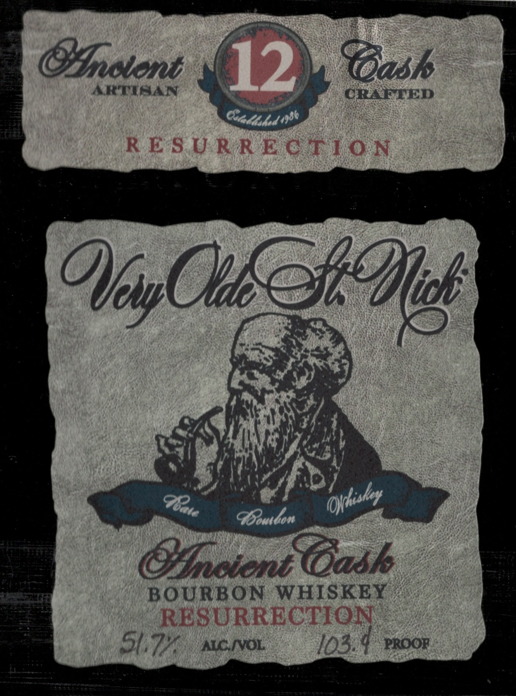
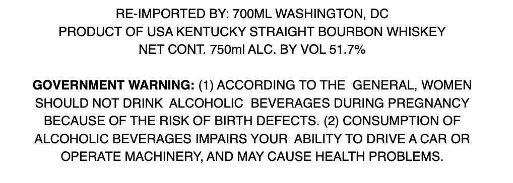
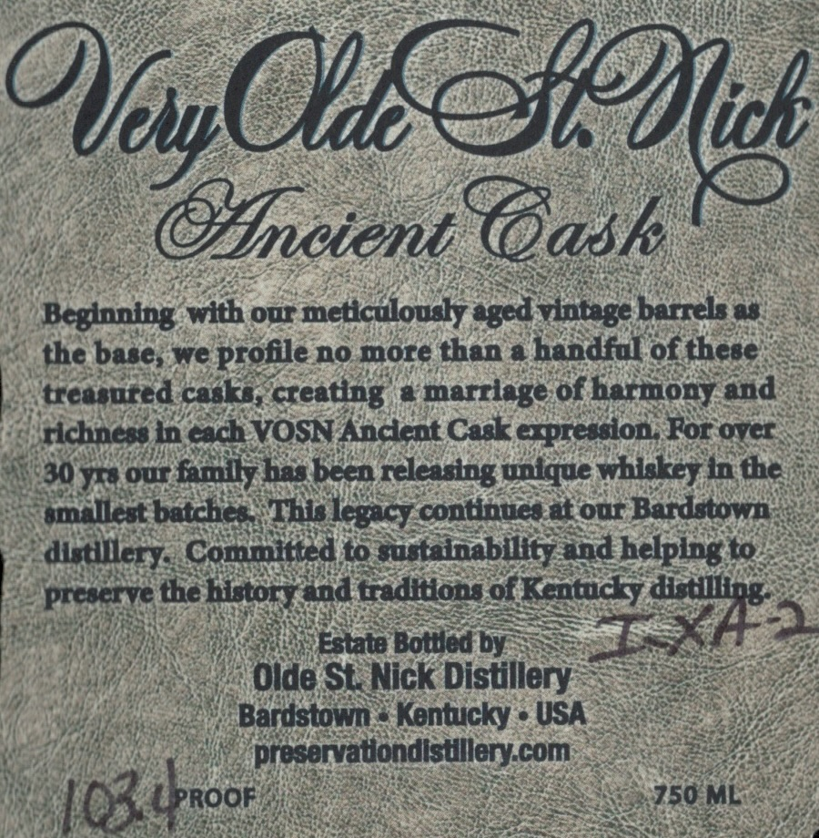

# TTB COLA Label Images - TTBID 26071001000992

**Brand Name:** VERY OLDE ST. NICK

**Fanciful Name:** RESURRECTION

**Issue Date:** 03/23/2026

**Origin Code:** 4K

**Product Class/Type:** 101

**Source:** [TTB Public COLA Registry](https://ttbonline.gov/colasonline/viewColaDetails.do?action=publicFormDisplay&ttbid=26071001000992)

## Label Images

### Label 1

### Label 2

### Label 3

## Extracted Label Text

*Text extracted via OCR - may contain errors*

**Detected Proof:** 103.4

### Label 1

GIslonb
12
(ask
AKTAAN
CRLETED
Oadasked 4906
RES U RRECTIO N
Goomdom
Osmotent(dask
BOURBON
WHISKEY
RESURRECTION
Skt
ACNVOL
103 4
PROOR
OefOlg
Olsy
Othiskor
G8ate

### Label 2

RE-IMPORTED BY: 7OOML WASHINGTON, DC
PRODUCT OF USA KENTUCKY STRAIGHT BOURBON WHISKEY
NET CONT: 750ml ALC. BY VOL 51.7%
GOVERNMENT WARNING: (1) ACCORDING TO THE GENERAL, WOMEN
SHOULD NOT DRINK ALCOHOLIC
BEVERAGES DURING PREGNANCY
BECAUSE OF THE RISK OF BIRTH DEFECTS. (2) CONSUMPTION OF
ALCOHOLIC BEVERAGES IMPAIRS YOUR ABILITY TO DRIVEA CAR OR
OPERATE MACHINERY, AND MAY CAUSE HEALTH PROBLEMS:

### Label 3

OKSeIOu
mcient GGask
Beglaning with our meticulously
tintaege barrels &
the base; we profile no more than a handful of these
treasured caske, creating
8
marriege of harmony and
richnees in cach VOSN Ancent Cask expression; For Ovcr
30YrE OuT
famly has becn rcleasing unique whrkey in the
emdllest batches
This
continues at our Bardstowmn
dietllleryCommitted to custalnabllityand helping to
prcscrve the hitoryend traditions 0 Kcatucy
Estate Bottled by
aoxne
Olde St Nick Distillery
Bardstown
Kentucky
USA
preservatondistllerycom
103 4pro0F
750 ML
Ofw(
eged
legaqy
