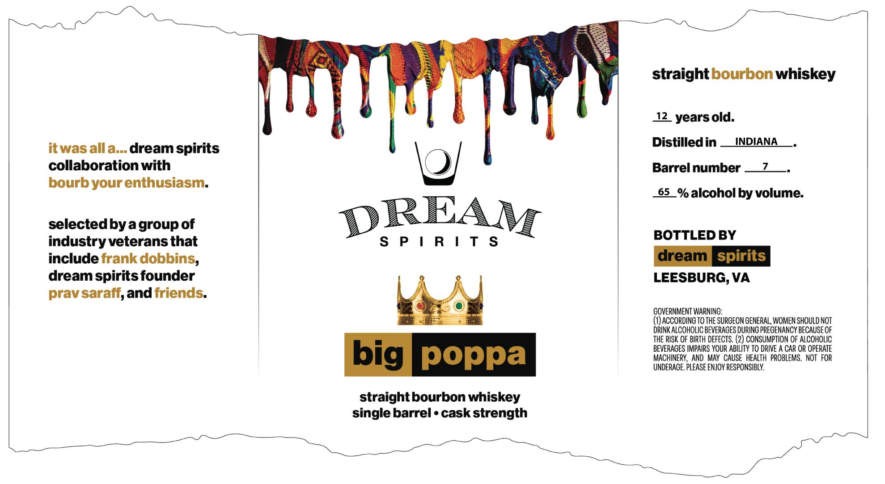

# TTB COLA Label Images - TTBID 26072001000195

**Brand Name:** DREAM SPIRITS

**Issue Date:** 03/16/2026

**Origin Code:** 05

**Product Class/Type:** 101

**Source:** [TTB Public COLA Registry](https://ttbonline.gov/colasonline/viewColaDetails.do?action=publicFormDisplay&ttbid=26072001000195)

## Label Images

### Label 1

## Extracted Label Text

*Text extracted via OCR - may contain errors*

**Detected Proof:** 130
**Detected Age:** 12 Years

### Label 1

straight bourbon whiskey
12 yearsold:
Distilled in
INDIANA
it was alla dream spirits
collaboration with
Barrel number
bourbyour enthusiasm
65
% alcohol by volume:
selectedbya group of
DREAM
industry veterans that
S P | R | T $
BOTTLED BY
include frank dobbins,
dream [ spirits
dream spirits founder
LEESBURG, VA
prav saraff,and friends:
GOVERNMENT WARNING:
(1) ACCORDING To THE SURGEON GENERAL, WOMEN SHOULD NOT
drInK ALCOHOLIC BeveRAGES DURING PREGENAncy BeCause OF
THE RISK OF BIRTH DEFECTS,
(2) consuMpTION OF AlcohoLIC
BEVERAGES IMPAIRS YOUR ABILITY TO DRIVE A CAR OR OPERATE
big poppa
MACHINERY, AND MAV  CAUSE  HEALTH  PROBLEMS.   NOT  FOR
UNDERAGE. PLease ENJOY RESPONSIBLY.
straight bourbon whiskey
single barrel
cask strength
