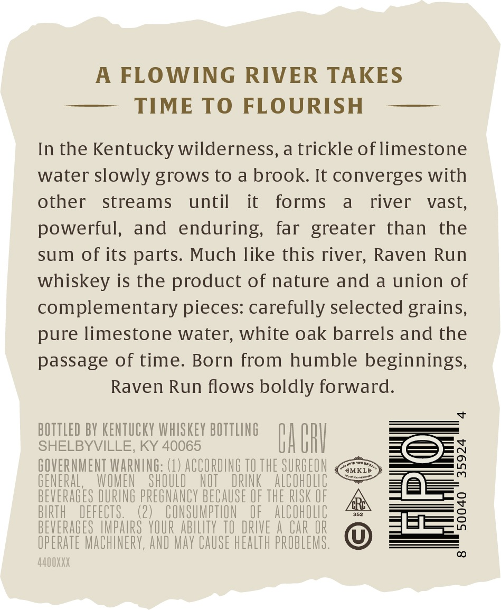
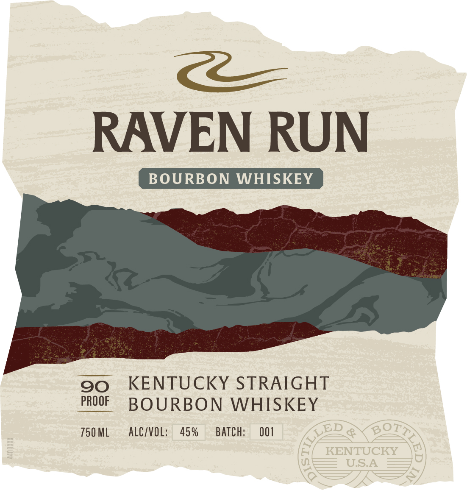

# TTB COLA Label Images - TTBID 26072001000209

**Brand Name:** RAVEN RUN

**Issue Date:** 03/16/2026

**Origin Code:** 22

**Product Class/Type:** 101

**Source:** [TTB Public COLA Registry](https://ttbonline.gov/colasonline/viewColaDetails.do?action=publicFormDisplay&ttbid=26072001000209)

## Label Images

### Back Label

### Front Label

## Extracted Label Text

*Text extracted via OCR - may contain errors*

**Detected Proof:** 90

### Back Label

A
FLOWING RIVER TAKES
TIME TO FLOURISH
In the
Kentucky wilderness, a trickle of limestone
water slowly grows to a brook: It converges with
other
streams
until
it
forms
a
river
vast,
powerful,
and enduring,
far greater
than
the
sum of its parts:
Much like this river; Raven Run
whiskey is the product of nature and a union of
complementary pieces: carefully selected grains,
pure limestone water; white oak barrels and the
passage of time:
Born from humble beginnings,
Raven Run flows
boldly forward:
BOTTLED BY KENTUCKY WHISKEY BOTTLING
SHELBYVILLE, KY 40065
BA Bh
GOVERNMENT WARNING: (1) ACCORDING TO THE SURGEON
4MKLE
1
GENERAL,
WOMEN
ShOULD
NOT
DRINK
AlCOhOlC
BEVERAGES DURING PREGNANCY BECAUSE OF THE RUSK OF
BIRTH
DEFECTS.
(2)
CONSUMPTLON
OF
AlCohOlC
8
BEVERAGES   |MpaurS  YOUR abilTy TO DRIVE A Car OR
OPERATE MaChINERY, AND MaY CAUSE HEALTH PROBLEMS.
440OXXX

### Front Label

RAVEN RUN
BOURBON
WHISKEY
90
KENTUCKY STRAIGHT
PROOF
BOURBON
WHISKEY
750 ML
ALC/VOL:
45 %
BATch:
001
BOTA
KENTUCKY
USA
LED
