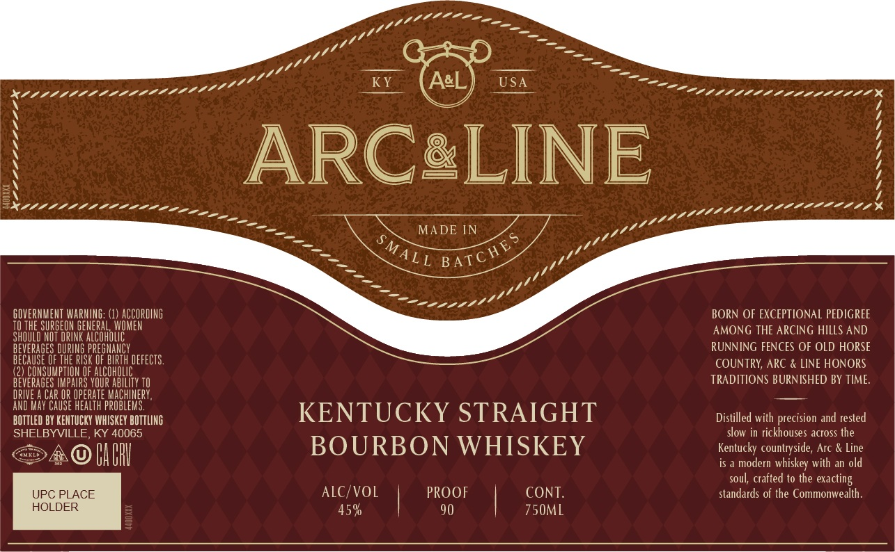

# TTB COLA Label Images - TTBID 26072001000242

**Brand Name:** ARC AND LINE

**Issue Date:** 03/16/2026

**Origin Code:** 22

**Product Class/Type:** 101

**Source:** [TTB Public COLA Registry](https://ttbonline.gov/colasonline/viewColaDetails.do?action=publicFormDisplay&ttbid=26072001000242)

## Label Images

### Front Label

### Label 2

## Extracted Label Text

*Text extracted via OCR - may contain errors*

*1 image(s) excluded: text did not meet readability threshold*

**Detected Proof:** 90

### Front Label

AL
USA
ARCaLINE
MADE IN
GOVERMMENT WARMING: (1) ACCOPDING
BORN OF EXCEPTIONAL PEDIGREE
Jae
OSBRERTRE
GEHEBoHdUDhER
AMONG THE ARCING HILLS AND
BEVERAGES DURING PREGMAncy
RUNNING FENCES OF OLD HORSE
BECAUSE OF THE RISk OF BIRTH DEFECTS.
COUNTRY; ARC & LINE HONORS
(2) CONSUMPTION OF
BEVERAGES TMPaIRS VOuR
OCOHBLEY L
TRADITIONS BURNISHED BY TIME
DRIVE
CAr OR OPEPATE MACHINERY;
AND May CAuSe HEALTh PROBLEMS.
KENTUCKY STRAIGHT
BOTTLED BY KENTUCKY WHISKEY BOTTLING
Distilled with precision and rested
SHELBYVILLE
KY 40065
slow in rickhouses across the
ARA
Bab
BOURBON WHISKEY
Kentucky countryside, Arc & Line
is a modern whiskey with an old
soul; crafted to the exacting
UPC PLACE
ALC/VOL
PROOF
CONT
standards of the Commonwealth
HOLDER
45%
90
750mL
7-2200b011b000bbw25
BATC HES
SMALL
