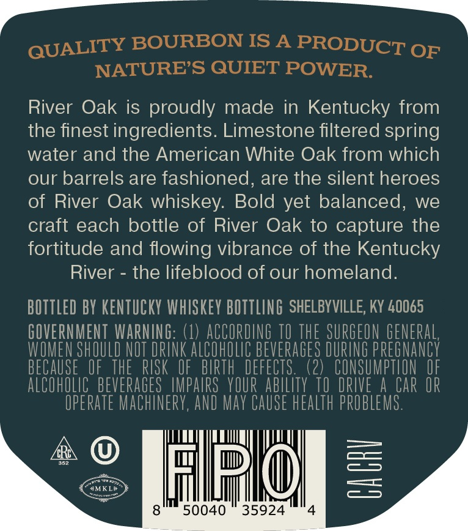
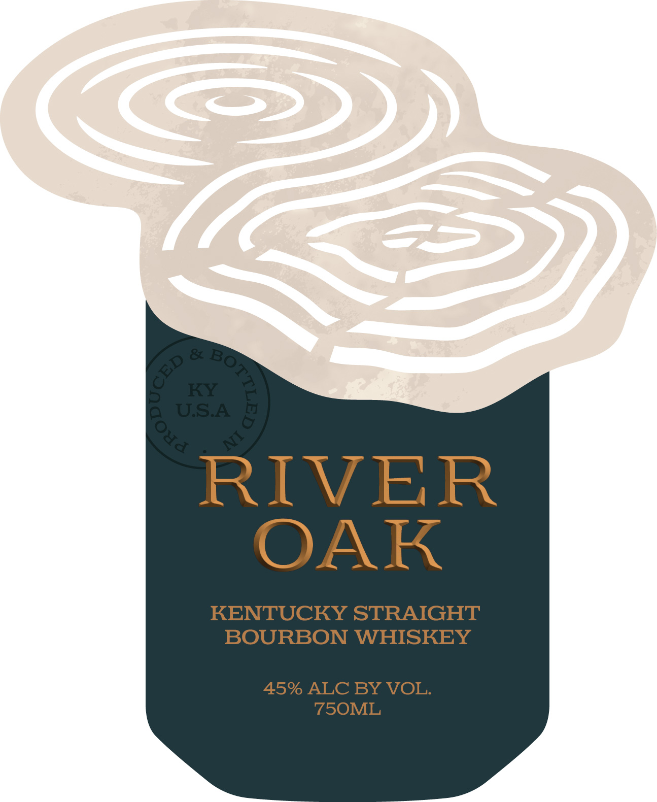
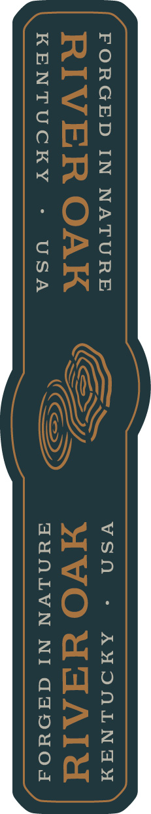

# TTB COLA Label Images - TTBID 26072001000363

**Brand Name:** RIVER OAK

**Issue Date:** 03/17/2026

**Origin Code:** 22

**Product Class/Type:** 101

**Source:** [TTB Public COLA Registry](https://ttbonline.gov/colasonline/viewColaDetails.do?action=publicFormDisplay&ttbid=26072001000363)

## Label Images

### Back Label

### Front Label

### Label 2

## Extracted Label Text

*Text extracted via OCR - may contain errors*

**Detected Proof:** 90

### Back Label

QUALITY BOURBON IS A PRODUCT of

NATURE’S QUIET POWER

River Oak is proudly made in Kentucky from

the finest ingredients. Limestone filtered spring

water and the American White Oak from which

our barrels are fashioned, are the silent heroes

of River Oak whiskey. Bold yet balanced, we

craft each bottle of River Oak to capture the

fortitude and flowing vibrance of the Kentucky

River - the lifeblood of our homeland

BOTTLED BY KENTUCKY WHISKEY BOTTLING SHELBYVILLE, KY 40065

GOVERNMENT WARNING:

(1) ACC

ING TO THE SURGEON GENERAL

WOMEN SHOULD NOT DRINK ALCOHOLIC BEVERAGES DURING PREGNANCY

(2) CONSUMPTION OF

ALCOHOLIC BEVERAGES IMPAIRS YOUR ABILITY

DRI

CAR OR

OPERATE MACHINERY, AND MAY CAUSE HEALTH PROBLEMS

WOT PLL

& ©

1H

Ua

50040 35924

### Front Label

RIVER

OAK

KENTUCKY STRAIGHT

BOURBON WHISKEY

45% ALC BY VOL.

750ML

### Label 2

a

FORGED IN NATURE VSO - AHONLINGAY

FYNLVN NI daDuwod

KENTUCKY = USA
