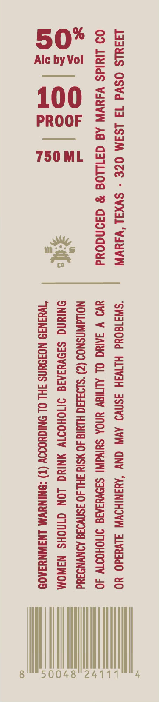
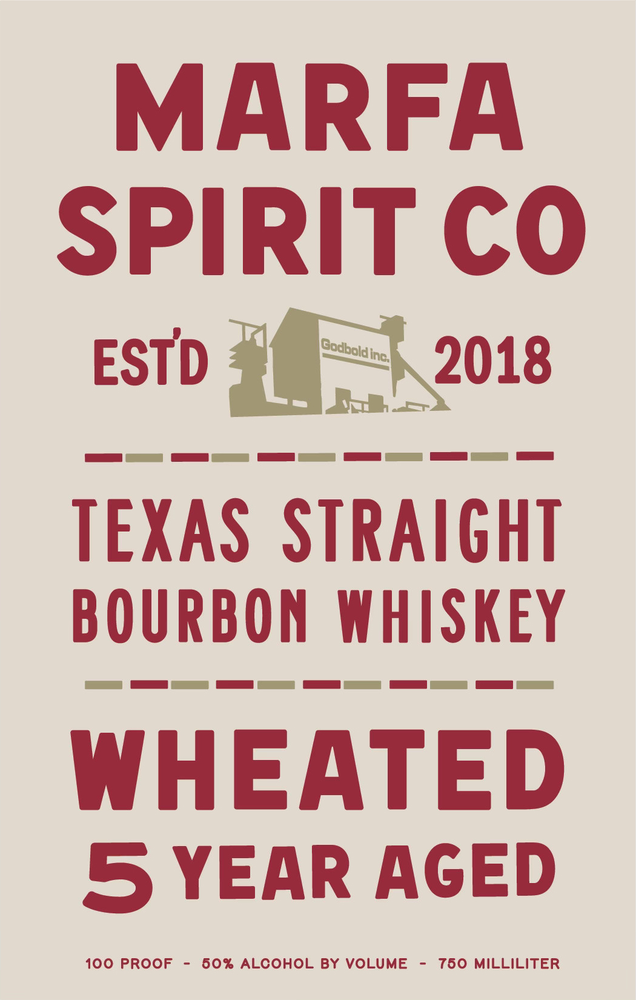

# TTB COLA Label Images - TTBID 26072001000421

**Brand Name:** MARFA SPIRIT CO

**Issue Date:** 03/18/2026

**Origin Code:** 44

**Product Class/Type:** 101

**Source:** [TTB Public COLA Registry](https://ttbonline.gov/colasonline/viewColaDetails.do?action=publicFormDisplay&ttbid=26072001000421)

## Label Images

### Back Label

### Front Label

## Extracted Label Text

*Text extracted via OCR - may contain errors*

**Detected Proof:** 100
**Detected Age:** 5 Years

### Back Label

I3IULS OSVd 14 LSIM OZE - SVXAL‘VIUVN “SW3180Ud HIIVJH 3SNVD AVN ONY ‘AUINIHOWW Jlvuad0 YO

09 LididS VAUVW Ad G3ILLOS % G3I0NGOUd Uv V JANG OL ALMIGY YNOA SHIVdWI SIDVUIAIG INMOHODIV 40
a NOLdWNSNOD (Z) *S193430 HIMIG 40 ¥STY HL 4O 3SNVIId ANYNDAUd

os |

ai =

ry
Zafe ONIUNG SIDVYIAIG IMOHOIV YNING LON GINOHS NIWOM
oe “WWUINID NOIOUNS FHL OL ONIGUOIOV (T) *ONINUVM LNAWNYIAOD

del

750 ML

4

50048 24111

1 MN

8

### Front Label

MARFA
SPIRIT CO
ESTD
inc
2018
TEXAS STRAIGHT
BOURBON WHISKEY
WHEATED
5 YEAR AGED
100 PROOF
60% ALCOHOL BY VOLUME
760 MiLLILITER
Godbold
