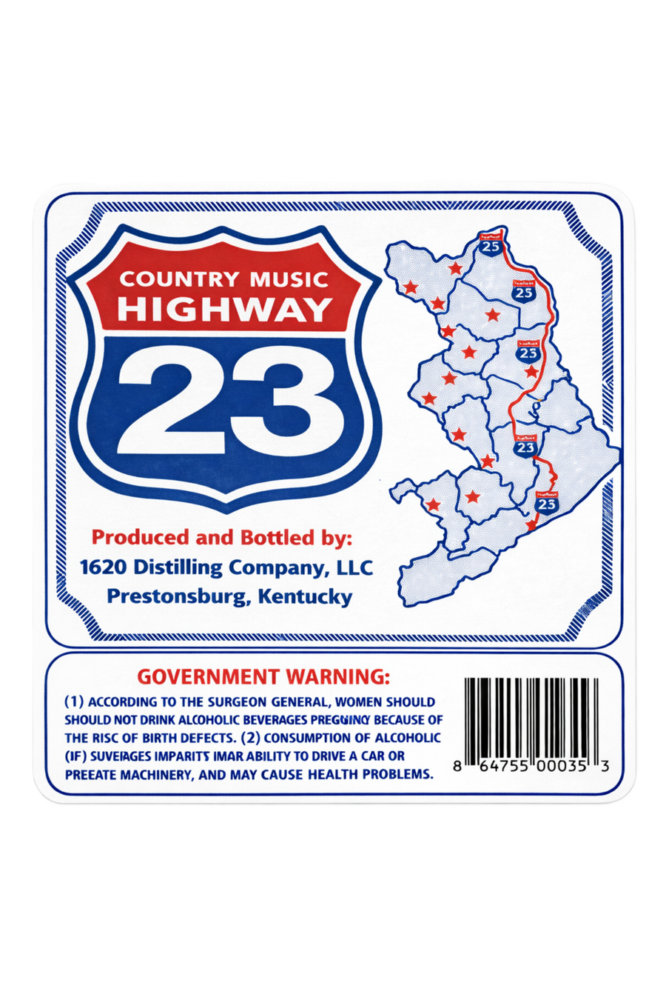
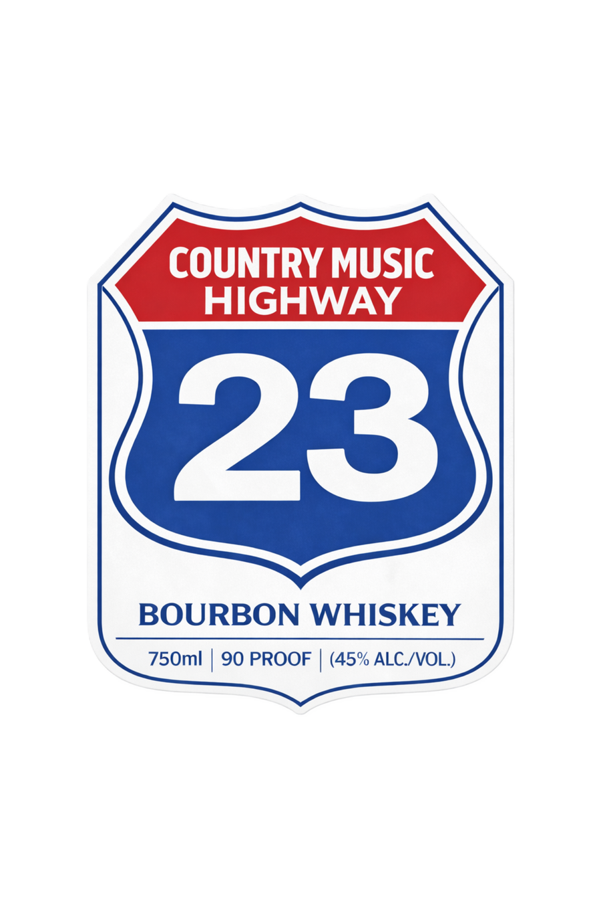

# TTB COLA Label Images - TTBID 26072001000471

**Brand Name:** COUNTRY MUSIC HIGHWAY

**Fanciful Name:** 1620 DISTILLING COMPANY

**Issue Date:** 03/17/2026

**Origin Code:** 22

**Product Class/Type:** 141

**Source:** [TTB Public COLA Registry](https://ttbonline.gov/colasonline/viewColaDetails.do?action=publicFormDisplay&ttbid=26072001000471)

## Label Images

### Back Label

### Front Label

## Extracted Label Text

*Text extracted via OCR - may contain errors*

**Detected Proof:** 90

### Back Label

COUNTRY
MUSIC
'25
HIGHWAY
23
25
Produced and Bottled by:
1620 Distilling Company, LLC
Prestonsburg, Kentucky
GOVERNMENT WARNING:
(1) ACCORDING TO THE SURGEON GENERAL, WOMEN SHOULD
SHOULD NOT DRINK ALCOHOLIC BEVERAGES PREGUING BECAUSE OF
THE RISc OF BIRTH DEFECTS: (2) CONSUMPTION OF ALCOHOLIC
(IF) SUVEIAGES IMPARITS IMAR ABILITY TO DRIVE A CAR OR
'64755"00035
PREEATE MACHINERY, AND MAY CAUSE HEALTH PROBLEMS:

### Front Label

COUNTRY MUSIC
HIGHWAY
23
BOURBON WHISKEY
750ml
90 PROOF
(45% ALC /VOL)
