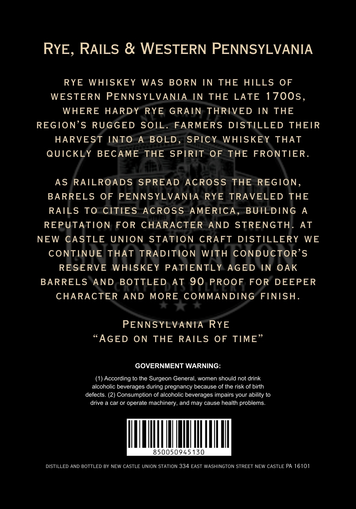
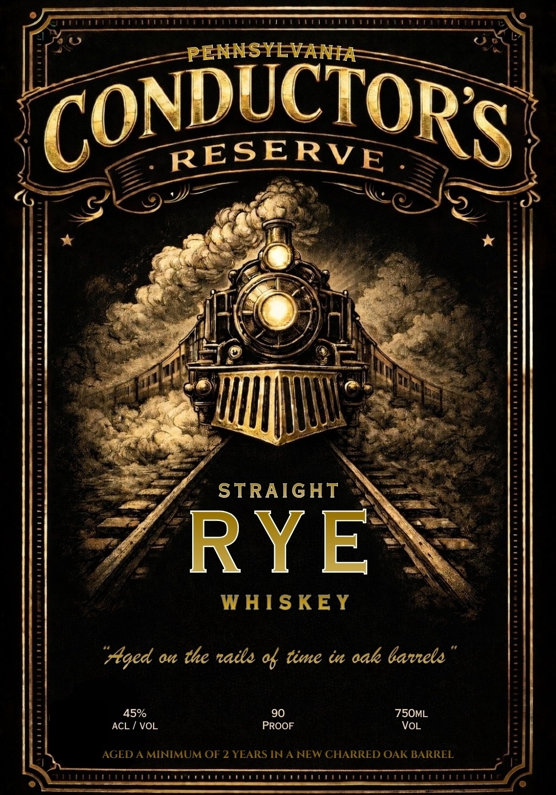

# TTB COLA Label Images - TTBID 26072001000515

**Brand Name:** PENNSYLVANIA CONDUCTOR'S

**Fanciful Name:** RESERVE STRAIGHT RYE WHISKEY

**Issue Date:** 03/23/2026

**Origin Code:** 39

**Product Class/Type:** 102

**Source:** [TTB Public COLA Registry](https://ttbonline.gov/colasonline/viewColaDetails.do?action=publicFormDisplay&ttbid=26072001000515)

## Label Images

### Back Label

### Front Label

## Extracted Label Text

*Text extracted via OCR - may contain errors*

**Detected Proof:** 90
**Detected Age:** 2 Years

### Back Label

RYE,
RAILS & WESTERN PENNSYLVANIA
RYE
WHISKEY
WAS
BORN
IN
THE
HILLS
OF
WESTERN
PENNSYLVANIA
IN THE
LATE 17005,
WHERE
HARDY
RYE GRAIN
THRIVED
IN THE
REGION'S RUGGED
SOIL. FARMERS
DISTILLED
THEIR
HARVEST INTO
A
BOLD
SPICY
WHISKEY
THAT
QUICKLY
BECAME THE SPIRIT 0F
THE
FRONTIER
As
RAILROADS
SPREAD
AcROSS
THE
REGION
BARRELS
OF
PENNSYLVANIA
RYE
TRAVELED THE
RAILS
To CITIES
AcROSS AMERICA,
BUILDING
A
REPUTATION FOR
CHARACTER
AND
STRENGTH
AT
NEW
CASTLE
UNION STATION CRAFT
DISTILLERY
WE
CONTINUE
THAT
TRADITION
WITH CONDUCTOR'S
RESERVE
WHISKEY
PATIENTLY
AGED
IN OAK
BARRELS
AND BOTTLED
At 90 PROOF FOR
DEEPER
CHARACTER
AND
MORE COMMANDING FINISH_
PENNSYLVANIA
RYE
"AGED
ON
THE
RAILS
OF TIME"
GOVERNMENT WARNING:
According to the Surgeon General;
women should not drink
alcoholic beverages during pregnancy because of the risk of birth
defects. (2) Consumption of alcoholic beverages impairs your ability to
drive a car or operate machinery, and may cause health problems
850050945130
DISTILLED AND BOTTLED BY NEW CASTLE UNION STATION 334 EAST WASHINGTON STREET NEW CASTLE PA 16101

### Front Label

PENNSYLVANIA
CONDECTORS
RESERVE
STRAIGHT
RYE
WHIS KEY
"Aged an the naile & time i aak barrele
45%
90
75OML
ACL
VOL
PROOF
VoL
AGED A MINIMUM OF 2 YEARS IN A NEW CHARRED OAK BARREL
