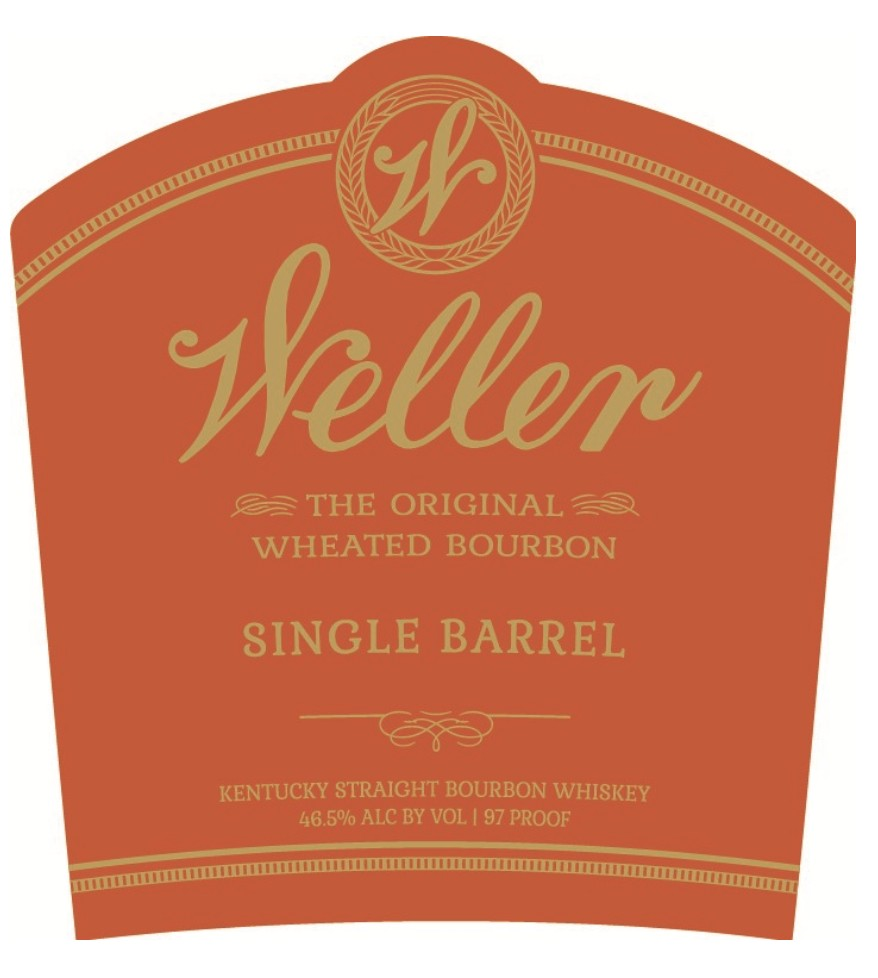

# TTB COLA Label Images - TTBID 26074001000030

**Brand Name:** WELLER

**Fanciful Name:** SINGLE BARREL

**Issue Date:** 03/17/2026

**Origin Code:** 00

**Product Class/Type:** 101

**Source:** [TTB Public COLA Registry](https://ttbonline.gov/colasonline/viewColaDetails.do?action=publicFormDisplay&ttbid=26074001000030)

## Label Images

### Label 1

### Label 2

## Extracted Label Text

*Text extracted via OCR - may contain errors*

**Detected Proof:** 93

### Label 1

sseller
THE ORIGINAL
WHEATED BOURBON
SINGLE BARREL
KENTUCKY STRAIGHT BOURBON WHISKEY
46.5% ALC BY VOL
97 PROOF

### Label 2

EXPORTED TO: UNITED KINGDOM
7OOML
RE-IMPORTED BY CONNOISSUER WINES USA PORT WASHINGTON,
NY
OBTAINED FROM A PRIVATE COLLECTION"
GOVERNMENT WARNING: (1) ACCORDING TO THE SURGEON GENERAL, WOMEN SHOULD NOT
DRINK ALCOHOLIC BEVERAGES DURING PREGNANCY BECAUSE OF THE RISK OF BIRTH
DEFECTS. (2) CONSUMPTION OF ALCOHOLIC BEVERAGES IMPAIRS YOUR ABILITY TO DRIVE A
CAR OR OPERATE MACHINERY
AND MAY CAUSE HEALTH PROBLEMS_
