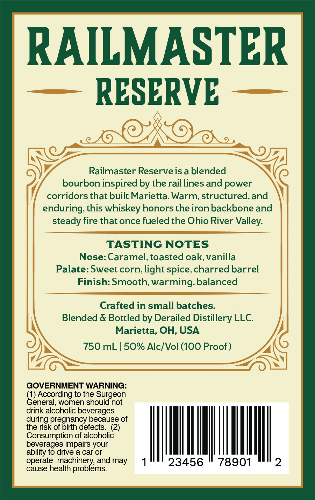
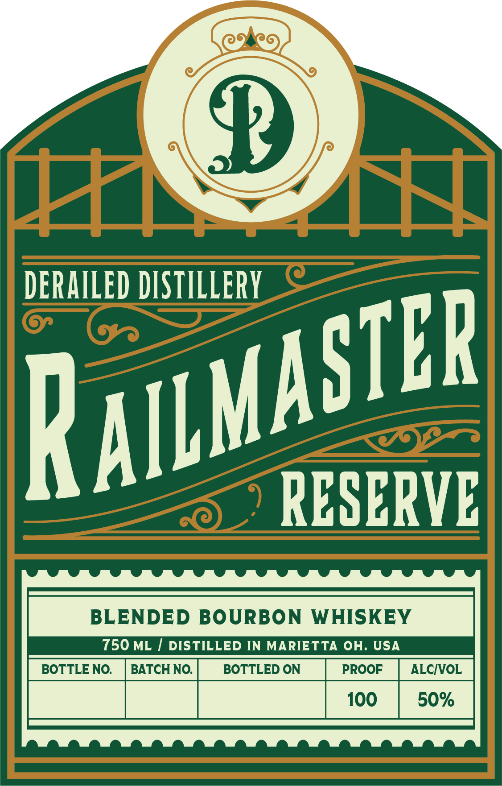
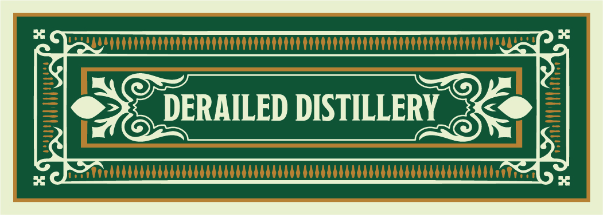
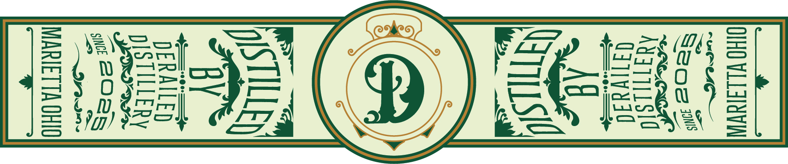

# TTB COLA Label Images - TTBID 26074001000121

**Brand Name:** DERAILED DISTILLERY

**Fanciful Name:** RAILMASTER RESERVE

**Issue Date:** 03/26/2026

**Origin Code:** 09

**Product Class/Type:** 131

**Source:** [TTB Public COLA Registry](https://ttbonline.gov/colasonline/viewColaDetails.do?action=publicFormDisplay&ttbid=26074001000121)

## Label Images

### Back Label

### Front Label

### Label 2

### Label 3

## Extracted Label Text

*Text extracted via OCR - may contain errors*

*2 image(s) excluded: text did not meet readability threshold*

**Detected Proof:** 100

### Back Label

RAILMASTER
RESERVE
Railmaster Reserve is a blended
bourbon inspired by the rail lines and power
corridors that built Marietta Warm; structured,and
enduring; this whiskey honors the iron backbone and
steady fire that once fueled the Ohio River Valley:
TASTING NOTES
Nose: Caramel, toasted oak;vanilla
Palate: Sweet corn; light spice, charred barrel
Finish: Smooth, warming, balanced
Crafted in small batches:
Blended & Bottled by Derailed Distillery LLC
Marietta, OH, USA
750 mL | 50% Alc/Vol (100 Proof)
GOVERNMENT WARNING:
(1) According to the Surgeon
General, women should not
drink alcoholic beverages
during pregnancy because of
the risk of birth defects  (2)
Consumption of alcoholic
beverages impairs your
ability to drive a car or
operate machinery; and may
23456
78901
2
cause health problems

### Front Label

F1
4H
DERAILED DISTILLERY
RESERVE
BLENDED BOURBON
WHISKEY
750 ML
DISTILLED IN MARIETTA OH. USA
BOTTLE NO
BATCH NO.
BOTTLED ON
PROOF
ALCIVOL
100
50%
RAILMASTER
