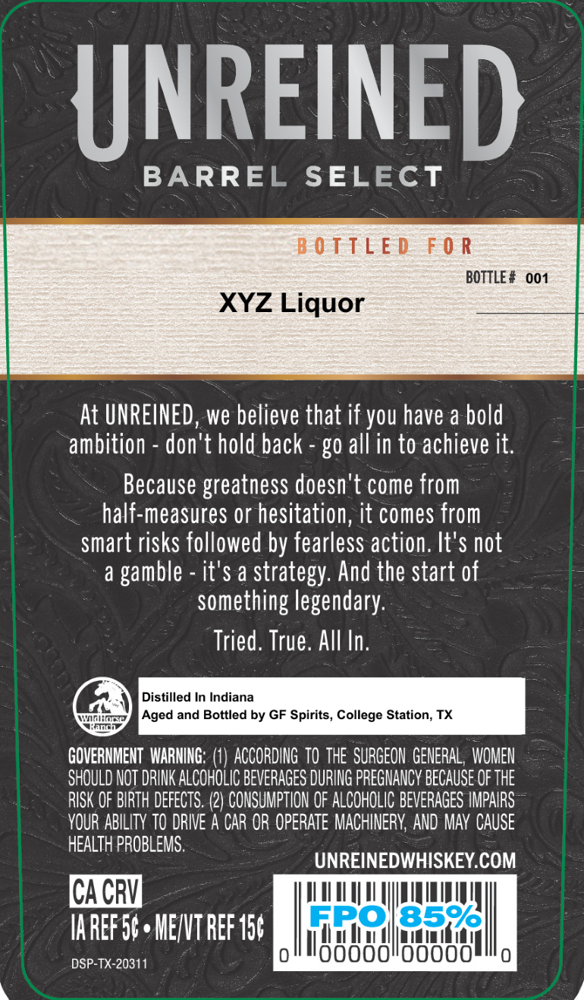
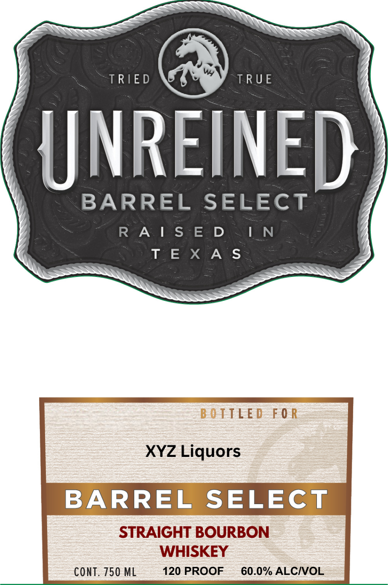

# TTB COLA Label Images - TTBID 26074001000150

**Brand Name:** UNREINED

**Fanciful Name:** BARREL SELECT

**Issue Date:** 03/16/2026

**Origin Code:** 44

**Product Class/Type:** 101

**Source:** [TTB Public COLA Registry](https://ttbonline.gov/colasonline/viewColaDetails.do?action=publicFormDisplay&ttbid=26074001000150)

## Label Images

### Back Label

### Label 1

### Label 2

## Extracted Label Text

*Text extracted via OCR - may contain errors*

*1 image(s) excluded: text did not meet readability threshold*

**Detected Proof:** 120

### Back Label

UNREINED
BARREL
SELECT
B 0 TTLE D
F 0 R
BOTTLE #
001
XYZ Liquor
At UNREINED, we believe that if you have a bold
ambition
don't hold back
g0 all in to achieve it.
Because greatness doesn't come from
half-measures or hesitation, it comes from
smart risks followed by fearless action. It's not
d
Igamble
it'$ a
strategy: And the start of
something legendary:
Tried. True. All In.
Distilled In Indiana
Wamactoe
Aged and Bottled by GF Spirits, College Station; TX
Fmct
GOVERNMENT  WARNING: (1) ACCORDING  TO the  SURGEON  GENERAL , WOMEN
SHOULD NOT DRINK ALCOHOLIC BEVERAGES DURING PREGMANCV BECAuSE OF THE
RISK OF BIRTH DEFECTS. (2) CONSUMPTION OF ALCOHOLIC BEVERAGES IMPAIRS
YOUR ABILITY TO DRIVE A CAR OR OPERATE MACHINERY; AND MAY CAUSE
hEalTh PROBLEMS,
UNREINEDWHISKEYCOM
CACRV
IAREF 50 , MENVT REF 156
Gbol8596
Ooo00
Ooooo
DSP-TX-20311

### Label 1

NREINE

BARREL SELECT

RAIS ED

I_N

TEXAS

PLE

0

XYZ Liquors

BARREL SELECT

STRAIGHT BOURBON

WHISKEY

CONT. 750 ML

120 PROOF 60.0% ALC/VOL
