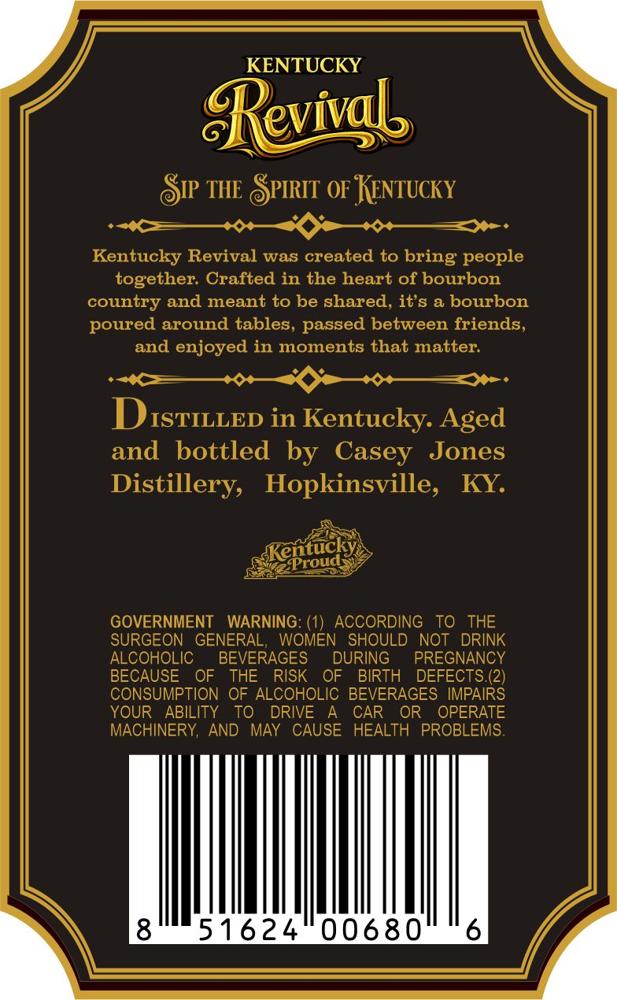
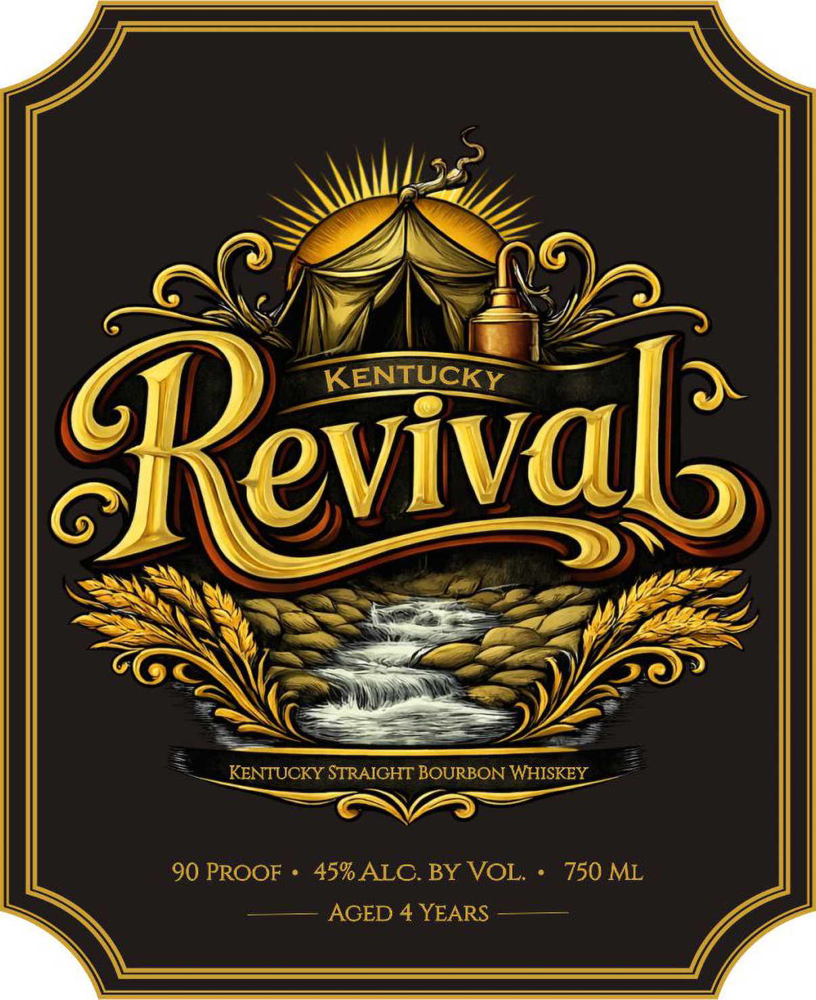

# TTB COLA Label Images - TTBID 26074001000155

**Brand Name:** KENTUCKY REVIVAL

**Issue Date:** 03/16/2026

**Origin Code:** 22

**Product Class/Type:** 101

**Source:** [TTB Public COLA Registry](https://ttbonline.gov/colasonline/viewColaDetails.do?action=publicFormDisplay&ttbid=26074001000155)

## Label Images

### Back Label

### Front Label

### Label 3

## Extracted Label Text

*Text extracted via OCR - may contain errors*

*1 image(s) excluded: text did not meet readability threshold*

**Detected Proof:** 90
**Detected Age:** 4 Years

### Back Label

KENTUCKY
evigb
SIP THE SPIRIT OF KENTUCKY
Kentucky Revival was created to bring people
together: Crafted in the heart of bourbon
country and meant to be shared, it's a bourbon
poured around tables, passed between friends,
and enjoyed in moments that matter:
DISTILLED in Kentucky: Aged
and
bottled by Casey
Jones
Distillery,
Hopkinsville,
KY
sKentuck
GOVERNMENT
WARNING: (1) ACCORDING
To THE
SURGEON
GENERAL
WOMEN
SHOULD
NOT
DRINK
ALCOHOLIC
BEVERAGES
DURING
PREGNANCY
BECAUSE
OF
THE
RISK
OF
BIRTH
DEFECTS.(2)
CONSUMPTION OF ALCOHOLIC BEVERAGES IMPAIRS
YOUR
ABILITY
To
DRIVE
CAR
OR
OPERATE
MACHINERY;
AND
MAY
CAUSE
HEALTH PROBLEMS
8
51624
00680
6
~Proud

### Front Label

KENTUCKY
Reval
KENTUCKY STRAICHT BOURBON WHISKEY
90 PROOF
45%ALC.BY VOL.
750 ML
AGED 4 YEARS
