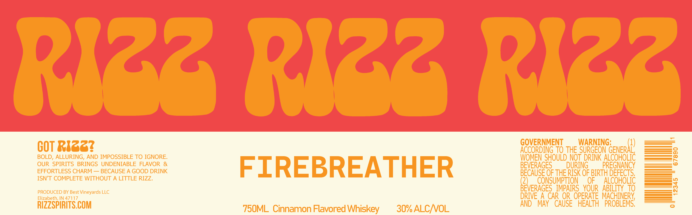

# TTB COLA Label Images - TTBID 26074001000189

**Brand Name:** RIZZ

**Fanciful Name:** FIREBREATHER

**Issue Date:** 03/18/2026

**Origin Code:** 19

**Product Class/Type:** 149

**Source:** [TTB Public COLA Registry](https://ttbonline.gov/colasonline/viewColaDetails.do?action=publicFormDisplay&ttbid=26074001000189)

## Label Images

### Label 1

## Extracted Label Text

*Text extracted via OCR - may contain errors*

**Detected Proof:** 60

### Label 1

R123 Ri23 Ri2z
COT RI33?
GOVERNMENT
WARNING;
ACCORDING TO THE SURGEON
BOLD, ALLURING, AND IMPOSSIBLE TO IGNORE:
WOMEN SHOULD' NOT DRINK ALCOHOLIC
8
OUR SPIRITS BRINGS UNDENIABLE FLAVOR
&
FIREBREATHER
BEVERAGES
DURING
PREGNANCY
T
EFFORTLESS CHARM
BECAUSE A GOOD DRINK
BECAUSE OF THE RISK OF BIRTH DEFECTS,
ISNT COMPLETE WITHOUT A LITTLE RIZZ
(2)
CONSUMPTION
OF
ALCOHOLIC
PRODUCED BY Best Vineyards LLC
BEVERAGES   IMPAIRS   YOUR   ABILITY  To
Elizabeth; IN 47117
DRIVE A CAR OR OPERATE MACHINERY
RIZZSPIRITS COM
AND
MAy   CAUSE
HEALTH
PROBLEMS;
750ML Cinnamon Flavored Whiskey
30% ALCNOL
"GeneRAL)
