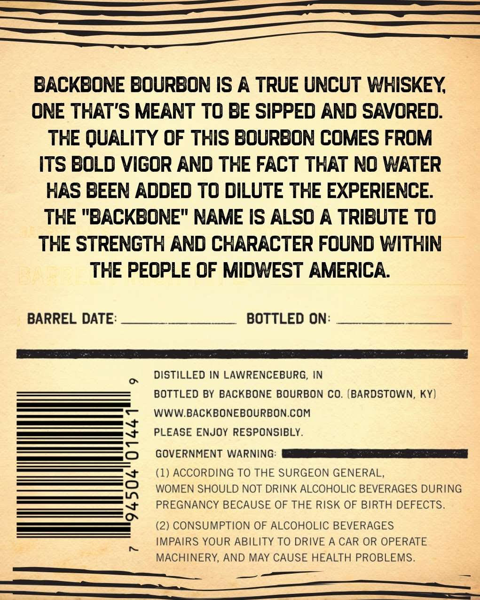
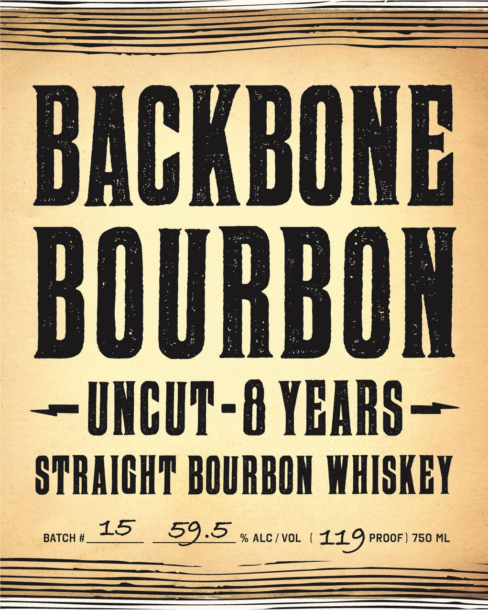

# TTB COLA Label Images - TTBID 26075001000056

**Brand Name:** BACKBONE BOURBON

**Issue Date:** 03/31/2026

**Origin Code:** 19

**Product Class/Type:** 101

**Source:** [TTB Public COLA Registry](https://ttbonline.gov/colasonline/viewColaDetails.do?action=publicFormDisplay&ttbid=26075001000056)

## Label Images

### Back Label

### Front Label

## Extracted Label Text

*Text extracted via OCR - may contain errors*

**Detected Proof:** 119

### Back Label

BACKBONE Bourbon IS A TRUE UNCUT WHISKEY
ONE THAT'S MEANT To BE SIPPED AND SAVORED:
THE QUALITY 0F THIS BOuRBON COMES FROM
ITS BOLd Vigor AND THE FACT THAT NO WATER
HAS BEEN AddEd To DILuTE THE EXPERIENCE
THE "BACKBONE" NAME IS ALSO A TRIBUTE TO
THE STRENGTH AND CHARACTER FOUND WITHIN
THE PEOPLE OF MIDWEST AMERICA
BARREL DATE:
BOTTLED ON:
DISTILLED IN LAWRENCEBURG, IN
0
BOTTLED BY BACKBONE BOURBON CO. (BARDSTOWN, Ky)
WWW.BACKBONEBOURBON.COM
PLEASE ENJOY RESPONSIBLY.
3
GOVERNMENT WARNING:
(1) ACCORDING TO THE SURGEON GENERAL,
WOMEN SHOULD NOT DRINK ALCOHOLIC BEVERAGES DURING
8
PREGNANCY BECAUSE OF THE RISK OF BIRTH DEFECTS.
(2) CONSUMPTION OF ALCOHOLIC BEVERAGES
IMPAIRS YOUR ABILITY TO DRIVE A CAR OR OPERATE
MACHINERY, AND MAY CAUSE HEALTH PROBLEMS.

### Front Label

BACKBONB
BOURBON
~INCUT-8 YBARS =
STRAICHT BOURBOK WHISKEY
BATCH #
15
59.5
% ALC / VOL
119PROoF) 750 ML
