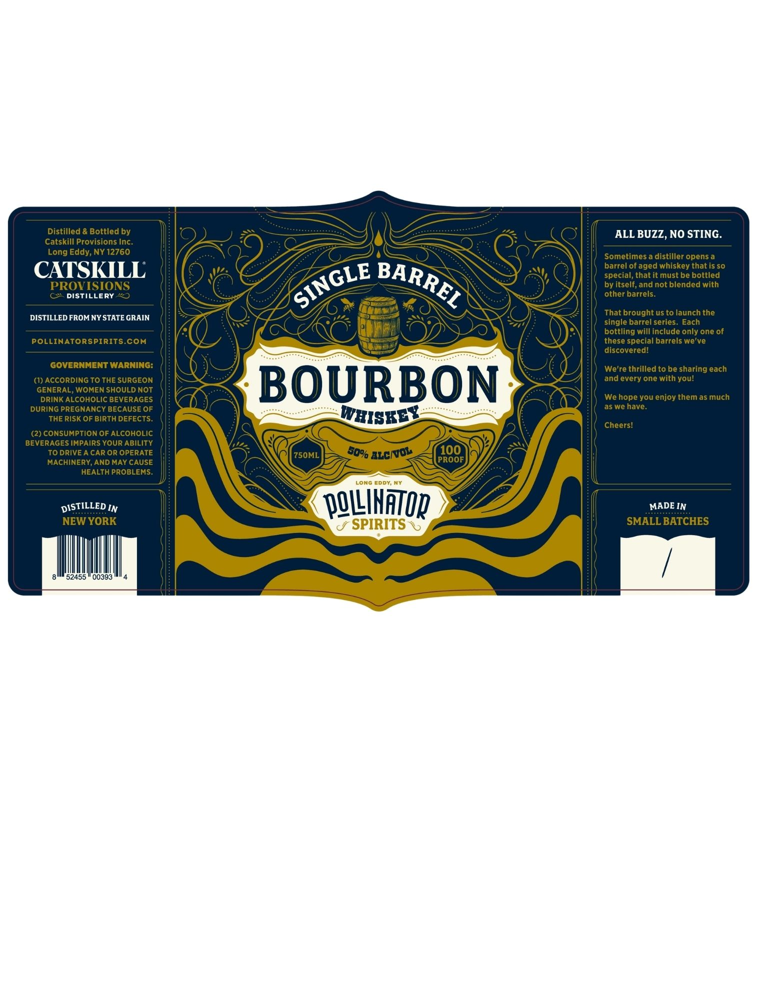

# TTB COLA Label Images - TTBID 26075001000182

**Brand Name:** POLLINATOR SPIRITS

**Fanciful Name:** SINGLE BARREL BOURBON WHISKEY

**Issue Date:** 03/17/2026

**Origin Code:** 02

**Product Class/Type:** 141

**Source:** [TTB Public COLA Registry](https://ttbonline.gov/colasonline/viewColaDetails.do?action=publicFormDisplay&ttbid=26075001000182)

## Label Images

### Front Label

## Extracted Label Text

*Text extracted via OCR - may contain errors*

### Front Label

Distilled & Bottled by
ALL BUZZ, NO STING.
Catskill Provisions Inc
Long Eddy; NY 12760
Sometimes a distiller opens a
CATSKILL
barrel of aged whiskey that is so
special, that it must be bottled
PROVISIONS
by itself; and not blended with
C
DIStILLERy
other barrels.
That brought us to launch the
DISTILLED FROM NY STATE GRAIN
single barrel series.
Each
bottling will include only one of
POLLINATORSPIRITS.COM
these special barrels we've
discoveredl
GOVERNMENT WARNING:
We're thrilled to be sharing each
(1) ACCORDING TO THE SURGEON
and every one with youl
GENERAL, WOMEN SHOULD NOT
BOURBON
DRINK ALCOHOLIC BEVERAGES
We hope you enjoy them as much
DURING PREGNANCY BECAUSE OF
as we have_
THE RiSk OF BIRTH DEFECTS.
WHISKEY
Cheersi
(2) CONSUMPTION OF ALCOHOLIC
BEVERAGES IMPAIRS YOUR ABILITY
To DRIVE A CAR OR OPERATE
75OML
ALcI
100
MACHINERY, AND MAY CAUSE
PROOF
HEALTH PROBLEMS.
LONG EDDY;
DISTILLED IN
p@LLINATOp
MADE IN
NEW YORK
SPIRITS
SMALL BATCHES
52455
00393
BARREL
SINGLE
5040
Nol
