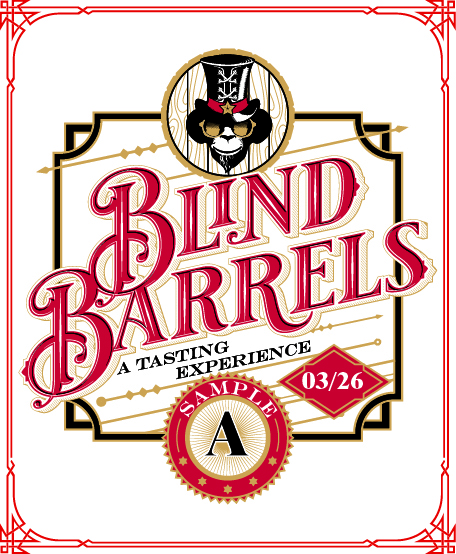
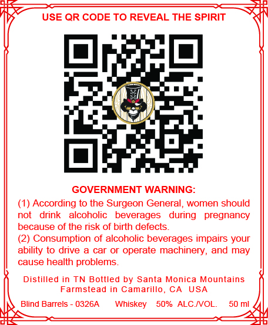

# TTB COLA Label Images - TTBID 26075001000202

**Brand Name:** BLIND BARRELS - 0326A

**Issue Date:** 03/30/2026

**Origin Code:** 01

**Product Class/Type:** 140

**Source:** [TTB Public COLA Registry](https://ttbonline.gov/colasonline/viewColaDetails.do?action=publicFormDisplay&ttbid=26075001000202)

## Label Images

### Back Label

### Front Label

## Extracted Label Text

*Text extracted via OCR - may contain errors*

**Detected Proof:** 100

### Back Label

Bind
ICE
MP
03/26
BARRELS
TASTING
EXPERIEN

### Front Label

USE QR CODE TO REVEAL THE SPIRIT
GOVERNMENT WARNING:
According to the Surgeon General,
women should
not
drink
alcoholic
beverages
during
pregnancy
because of the risk of birth defects_
(2) Consumption of alcoholic beverages impairs your
ability to drive a
car or operate machinery,
may
cause health problems_
Distilled in TN Bottled by Santa Monica Mountains
Farmstead
in Camarillo
CA
USA
Blind Barrels
0326A
Whiskey
50% ALCIVOL:
50 mi
and
