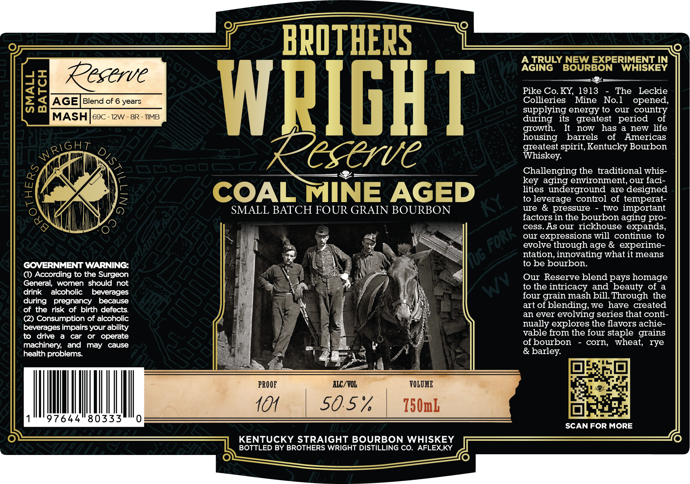

# TTB COLA Label Images - TTBID 26075001000237

**Brand Name:** BROTHERS WRIGHT RESERVE

**Issue Date:** 03/17/2026

**Origin Code:** 22

**Product Class/Type:** 101

**Source:** [TTB Public COLA Registry](https://ttbonline.gov/colasonline/viewColaDetails.do?action=publicFormDisplay&ttbid=26075001000237)

## Label Images

### Label 1

## Extracted Label Text

*Text extracted via OCR - may contain errors*

**Detected Age:** 6 Years

### Label 1

BPOTHEPS
A TRULY NEW EXPERIMENT IN
AGING
BOURBON
WHISKEY
Reserve
dd
AGE
Blend of 6 years
WPIGHT
Eiodieresy Mie
Norhe
opeclee;
supplying energy to
our
country
MASH
69C
12W
8R - IIMB
during
its   greatest   period
of
growth:
It
now
has
new life
housing
barrels
of
Americas
greatest spirit,Kentucky Bourbon
eserve
Whiskey
Challenging the traditional whis-
key aging environment, our faci-
{
2
COAL MINE AGED
tieeragerContro oeteespered
G)
SMALL BATCH FOUR GRAIN BOURBON
K
ure
& pressure
two important
factors in the bourbon aging
cess.As our rickhouse expands,
our
expressions will continue
to
evolve through age & experime-
ntation, innovating what it means
GOVERNMENT WARNING:
to be bourbon.
(I) According to the Surgeon
Our Reserve blend pays homage
General;
women should
not
to the intricacy
and beauty of a
drink
alcoholic
beverages
four grain mash bill Through
the
during
pregnancy
because
art of blending; We
have created
of the risk
of birth defects
an ever
evolving series that conti-
(2) Consumption of alcoholic
beverages impairs your ability
nually explores the flavors achie-
to
drive
car
or   operate
vable from the four staple grains
machinery;
and
may
cause
of bourbon
corn
wheat;
rye
health problems:
& barley:
PROOF
ALC/VOL
VOLOME
104
50.57
750mL
97644
80333
SCAN FOR MORE
KENTUCKY STRAIGHT BOURBON WHISKEY
BOTTLED BY BROTHERS WRIGHT DISTILLING CO.
AFLEX,KY
WRIGHT
pro-
Fork _
Ug
Wv
