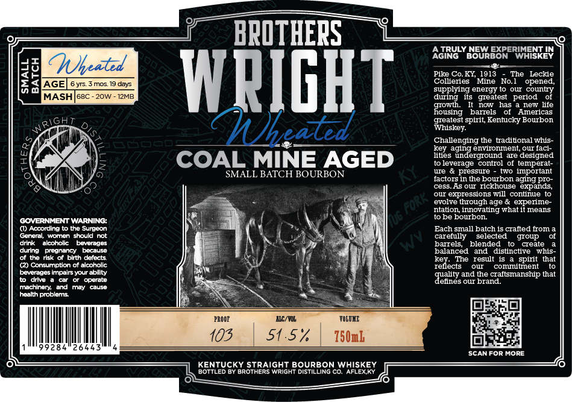

# TTB COLA Label Images - TTBID 26075001000243

**Brand Name:** BROTHERS WRIGHT WHEATED

**Issue Date:** 03/17/2026

**Origin Code:** 22

**Product Class/Type:** 101

**Source:** [TTB Public COLA Registry](https://ttbonline.gov/colasonline/viewColaDetails.do?action=publicFormDisplay&ttbid=26075001000243)

## Label Images

### Label 1

## Extracted Label Text

*Text extracted via OCR - may contain errors*

**Detected Proof:** 103
**Detected Age:** 6 Years

### Label 1

BPOTHEPS
AGIRU
TRULY
BOMRBORERIFSKEN
dd
AGE
(healzt
6 yrs
mos 19 days
WRIGHT
Polererz M1e No he operee
supplyng energy tO
our county
MASH
68C
20w -
12MB
during
its   greatest   period
nOw
has
new lfe
fousug
banels
Americas
RIGh
greatest spirit, Kentucky Bourbon
"habd
Challengig the braditional wus-
Key aging envronment, QuI facl-
lities underground
are designed
COAL MINE AGED
leverage
control
temperat-
SMALL BATCH BOURBON
uie
pressure
two Important
factors in the bourbon aging pro-
cess_As our rickhouse expands,
our expressions will continue
evolve tlough age & experime-
ntation innovating vhat it means
GOVERNMENT WARNING:
Us
to be bourbon:
() According t0 the Surgeon
Each small batch Is crafted from
General, women should not
carefully
selected
group
drink
alcoholic
Dovorddos
barrels
blended
create
durng
Dreanangy
Decuuso
balanced
and
distinctive
whis-
the nsk 0i
birth delects
key:
The
resut 15
that
( Consumption ot alcoholic
rellects
our
conntmnent
beverages impairs your ability
quality and the craftsmanship that
to drive
operate
defines our brand:
machinory and
Wudy
cause
hoalth problems
PROQE
AEC/ YOL
TOLOLE
103
51.5%
750mk
9284
26445
SCANFOR More
KENTUCKY STRAiGHT BOURBON WHISKEY
BOTTLED BY BROTHERS WRIGHT DISTILLING CO. AFLEXKY
~Fork ,
splt
