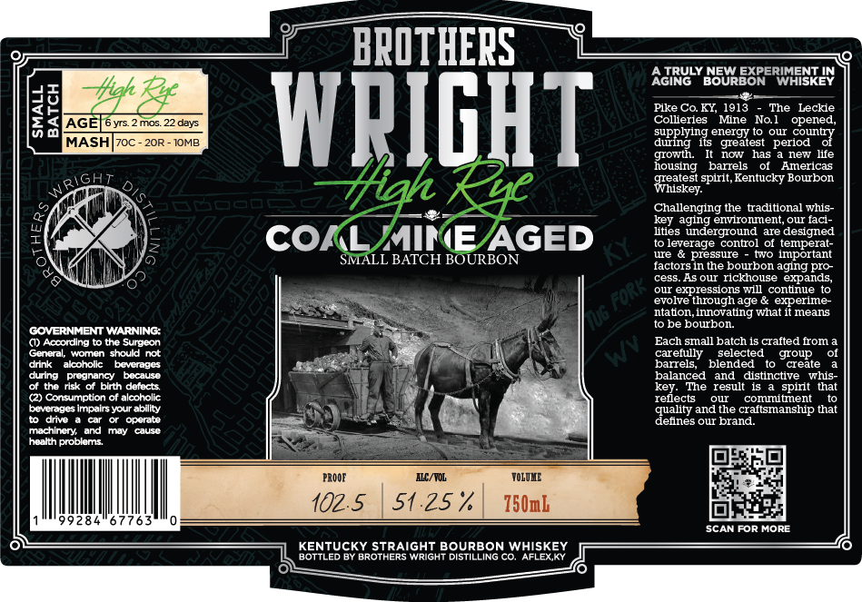

# TTB COLA Label Images - TTBID 26075001000248

**Brand Name:** BROTHERS WRIGHT HIGH RYE

**Issue Date:** 03/17/2026

**Origin Code:** 22

**Product Class/Type:** 101

**Source:** [TTB Public COLA Registry](https://ttbonline.gov/colasonline/viewColaDetails.do?action=publicFormDisplay&ttbid=26075001000248)

## Label Images

### Label 1

## Extracted Label Text

*Text extracted via OCR - may contain errors*

**Detected Proof:** 102.5
**Detected Age:** 6 Years

### Label 1

BPOTHERS
AGIRULY BOUREORERIESKEN
Hhgh _
da
AGE
6 yrs  2 mos 22 days
WPIGHT
Eolezierz' Ma1e No he operee
supplying energy
our country
MASHIzoc_
2OR
IOMB
during
its   greatest  period
growth
nOw
has
new life
housing
barrels
Americas
RIGh
#ah
ITaaseey s
spirit,Kentucky Bourbon
Challenging the traditional whis
key aging envronnent, OUI Iacl -
COI
MIREJAGED
liieeveragergotrd are eepened
SMALL BATCH BOURBON
we
pressure
two mmportant
factors in the bourbon aging pro
cess.As our rickhouse expands,
our expressions will continue to
evolve throughage & experime
ntaton,Inovating what i means
be bourbon
COVERNMENT WARNING:
() According
the Surgeon
Each small batch Is crafted from
General
Women
should not
carefully
selected
group
drink
akoholic
Deverader
barrels
blended
create
durng
Diednang
bocauso
balanced
and
distinctive
Ths-
or the rsk
blrth defects
key
The result 1S
that
(2) Consumption of alcoholic
reflects
commnitment
beverages Impalrs your ability
quality and the craftsmanship that
drive
operate
dennes ouI brand:
machinery; and
Faay
Causi
heatth probloms
PROOF
LLC/YOL
TOLTIE
102.5
51.25%
750mb
284
SCAN For More
KENTUCKY STRAIGHT BOURBON WHISKEY
BOTTLED By BrothERS WrIGHT DISTILLING cO. AFLEXKY
~Fork _
Yu6
splnt
