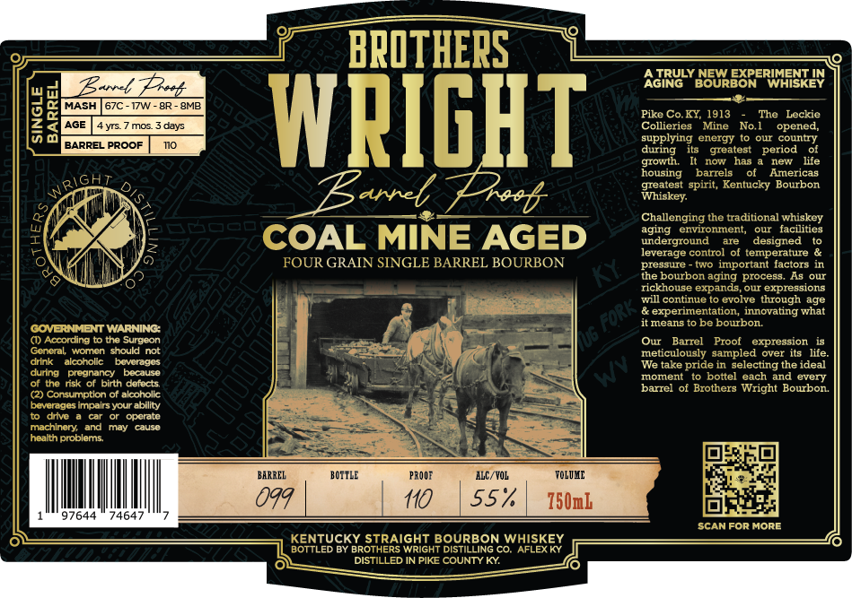

# TTB COLA Label Images - TTBID 26075001000250

**Brand Name:** BROTHERS WRIGHT BARREL PROOF

**Issue Date:** 03/17/2026

**Origin Code:** 22

**Product Class/Type:** 101

**Source:** [TTB Public COLA Registry](https://ttbonline.gov/colasonline/viewColaDetails.do?action=publicFormDisplay&ttbid=26075001000250)

## Label Images

### Label 1

## Extracted Label Text

*Text extracted via OCR - may contain errors*

**Detected Age:** 4 Years

### Label 1

BPOTHEPS
Zit
AGIRULY BOURBORERIEISKEN
MASH
57C -
I7W
BNAB
3]
AGE
4yrs
mor
Oavs
WRIGHT
Ciollicries , Mgne
NoTheoperede
supplying energy t0 our country
BARREL PROOF
during
greatest
period
It   now
has
ner
lite
housing
barrels
Amnericas
6h
spirit, Kentucky Bourbon
Zunel
Lrast
Whiskey
Challenging the traditional whiskey
agig
enronmient,
facilities
COAL MINE AGED
uderground
designed
leverage control of temperature &
FOUR GRAIN SINGLE BARREL BOURBON
pressute
two important factors in
the bourbon aging process. As ouI
rickhouse expands
expressions
will continue
evolve
though age
experimentation, innovating what
means t0 pe bourbon
COVERNIMENT WARNING:
() According
the Surgeon
06
Ou
Barrel
Proof
expression
Gencral women should not
meticulously sampled
over It5
Jite
drink
alcoholkc
bovCrradd
We take pride in selecting the ideal
dunng
preanancy
because
oment
bottel each and every
afethe risk otbinth Gefects
(2) Consumption of alcoholic
barrel of Brothers Wright Bourbon
beverages impairs your ability
drive
operate
machincry and
Faan
causd
heaith problems
BARBEL
BOTILE
PRDOI
ILC /VOL
TQLTXE
Oqq
110
557
750mb
97644
74647
SCAN For MORE
KENTUCKY STRAIGHT BOURBON
WVHFSKEY
BOTTLED BY BROTHERS WRIGHT DISTILLING CO.
DISTILLED IN PIKE COUNTY KY
pz
growth
greatest
~Fori +
