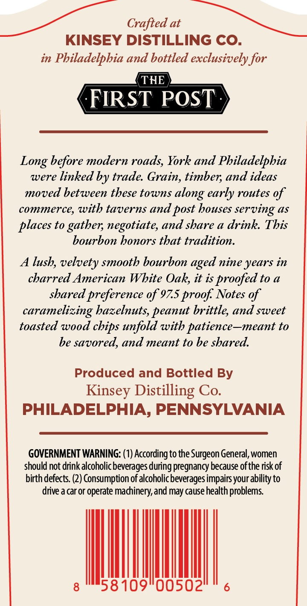
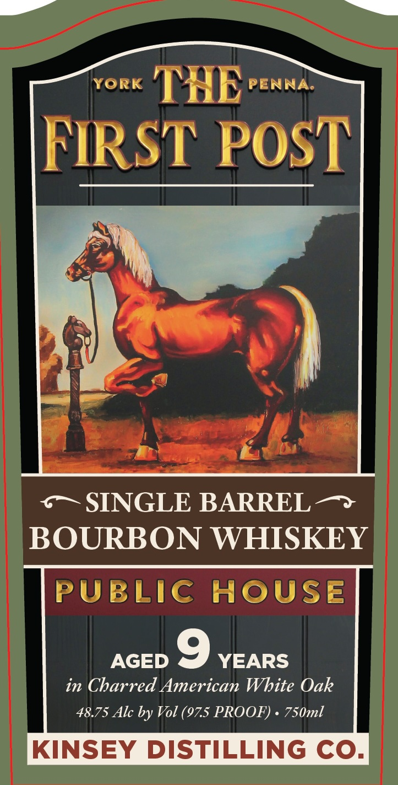

# TTB COLA Label Images - TTBID 26075001001041

**Brand Name:** THE FIRST POST

**Issue Date:** 03/19/2026

**Origin Code:** 39

**Product Class/Type:** 141

**Source:** [TTB Public COLA Registry](https://ttbonline.gov/colasonline/viewColaDetails.do?action=publicFormDisplay&ttbid=26075001001041)

## Label Images

### Back Label

### Front Label

## Extracted Label Text

*Text extracted via OCR - may contain errors*

**Detected Proof:** 97.5

### Back Label

Crafted at
KINSEY DISTILLING CO
in Pbiladelpbia and bottled exclusively for
THE
FRRST POST
Long before modern roads, York and Pbiladelphia
were linked by trade Grain, timber; and ideas
moved between tbese towns
early routes of
commerce, with taverns and post bouses
serving 4s
to
gathen; negotiate, and sbare a drink This
bourbon bonors tbat tradition.
A lusb, velvety smooth bourbon
nine years in
charred American Wbite Oak, it is proofed to a
shared preference of 975 proof Notes of
caramelizing bazelnuts, peanut brittle, and sweet
toasted wood
with patience-meant to
be savored, and meant to be sbared.
Produced and Bottled By
Distilling Co
PHILADELPHIA, PENNSYLVANIA
GOVERNMENT WARNING: (1) According to the Surgeon General,women
should not drink alcoholic beverages=
pregnancy because ofthe risk of
birth defects. (2) Consumption of alcoholic beverages impairs your ability to
drive a car or operate madinery,and may cause health problems
8
58 109"00502
along
places
aged
unfold
cbips
Kinsey
during

### Front Label

YORK
THE
PENNA:
FRRST POST
SINGLE BARREL
BOURBON WHISKEY
PUBLIC
HOUSe
AGED
c
YEARS
in Charred American Wbite Oak
48.75 Alc by Vol (97.5 PROOF)
750ml
KINSEY DISTILLING CO_
