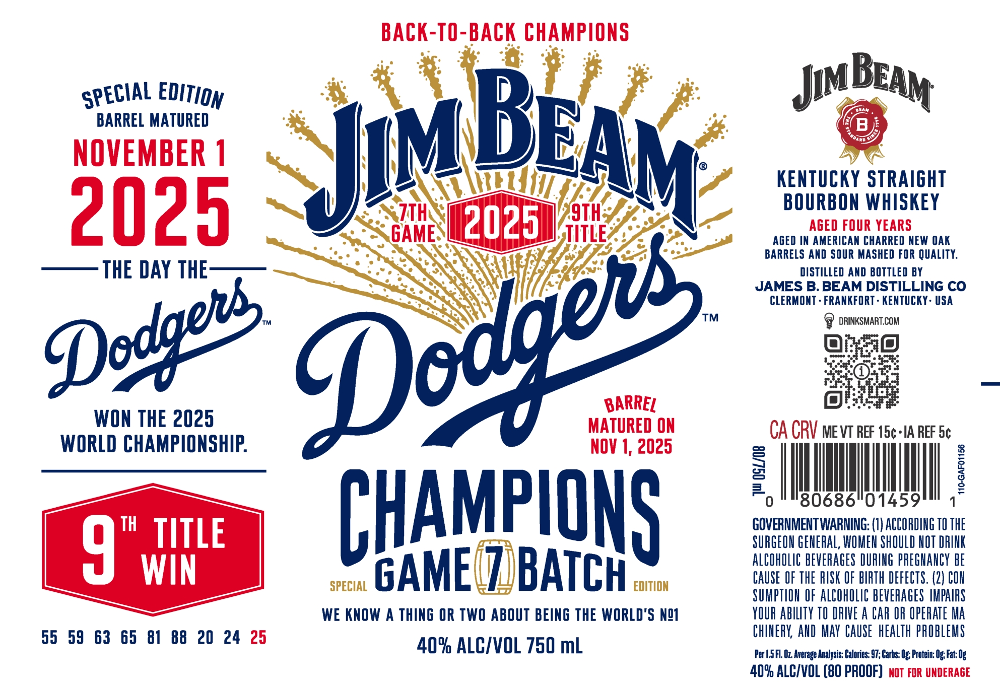
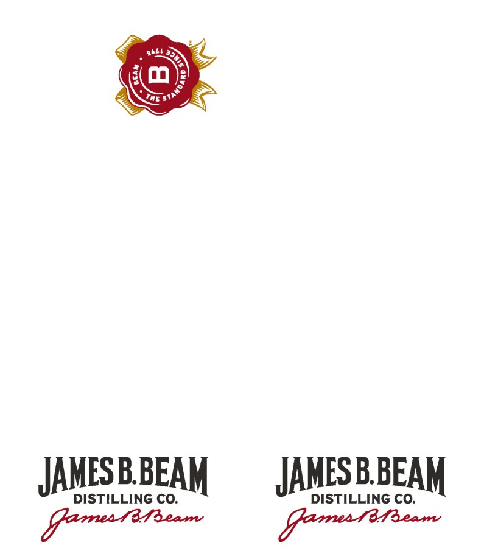

# TTB COLA Label Images - TTBID 26076001000093

**Brand Name:** JIM BEAM

**Issue Date:** 03/17/2026

**Origin Code:** 22

**Product Class/Type:** 101

**Source:** [TTB Public COLA Registry](https://ttbonline.gov/colasonline/viewColaDetails.do?action=publicFormDisplay&ttbid=26076001000093)

## Label Images

### Label 1

### Label 2

## Extracted Label Text

*Text extracted via OCR - may contain errors*

### Label 1

BACK-TO-BACK CHAMPIONS
Jim
BARREL MATURED
B
NOVEMBER 1
JMBEAM
KenTuCKY STRAIGHT
2025
SZTH
2025
9TH;
BOURBOMUWHASKEY
GAME
TITLE
AGED IN AMERICAN CHARRED NEW OAK
BARRELS AND SOUR MASHED FOR QUALITY:
THE DAY THE
DISTILLED AND BOTTLED BY
JAMES B. BEAM DISTILLING CO
CLERMONT . FRANKFORT - KENTUCKY - USA
TM
DRINKSMART.COM
BARREL
WON THE 2025
MATURED ON
CA CRV me vT REF 15c-IA REF 5c
WORLD CHAMPIONSHIP:
NOV 1, 2025
8
1
F
0
80686"01459
TH
TITLE
CHAMPIONS
GOVERNMENT WARNING: (I) ACCOPDING TO THE
4
SURGEON GENERAL; WOMEN SHOULD NOT DRINK
ALCOhOLIC BEVERAGES DURING PREGNANCY bE
WIN
SPECIAL
GAME
BATCH
EDITION
CAuse  OF THE RISK OF BIRTH DEFECTS. (2) COH
SUMPTION OF AlCOhOLIC bEVERAGeS IMPAIPS
WE KNOW A THING OR TWO ABOUT BEING THE WORLD'S N!I
YOUR AbILTy TO DRIVE A CAR OR OPERATE Ma
55  59
63  65
81  88   20 24 25
ChINERK AND MAY  CAUSE   heALTh pRObLEMS
409 ALC/VOL 750 mL
Per |.5FL Oz Arerage Analysis: Calories: 97; Carbs: Ug; Protein: Og Fat: Og
409 ALCIVOL (B0 PROOF]   NOT FOR UNDERAGE
BEAM
EDITION
SPECIAL
Dedgers
Dedgeis

### Label 2

The
JAMESBBEAM
JAMESBBEAM
DISTILLING CO:
DISTILLING CO:
Goustyieso _
Garnea Raear
O6l8
)
