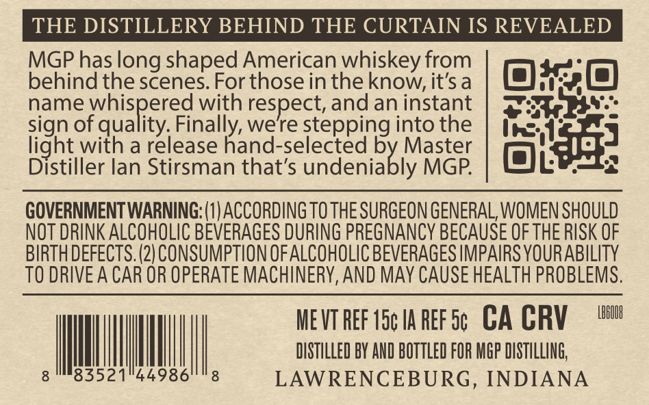
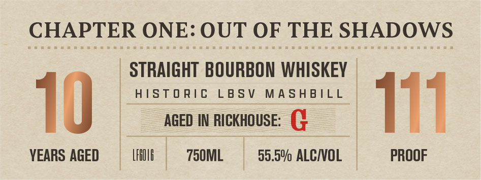
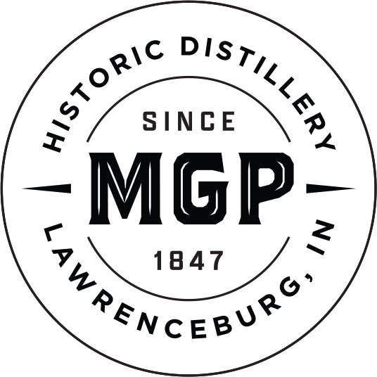
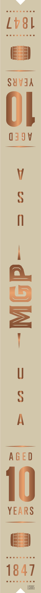

# TTB COLA Label Images - TTBID 26076001000095

**Brand Name:** MGP

**Issue Date:** 03/17/2026

**Origin Code:** 29

**Product Class/Type:** 101

**Source:** [TTB Public COLA Registry](https://ttbonline.gov/colasonline/viewColaDetails.do?action=publicFormDisplay&ttbid=26076001000095)

## Label Images

### Back Label

### Front Label

### Label 4

### Label 5

## Extracted Label Text

*Text extracted via OCR - may contain errors*

**Detected Proof:** 111

### Back Label

THE DISTILLERY BEHIND THE CURTAIN IS REVEALED
MGP has long shaped American whiskey from
behind the scenes  For thosein theknow,it's a
name whispered with respect, and an instant
sign of quality; Finally, were stepping into the
light with a release hand-selected
ledenisbly
Master
Distiller lan Stirsman that's
MGP
GOVERNMENTWARNING: (1) ACCORDING TO THE SURGEON GENERAL, WOMEN SHOULD
NOT DRINK ALCOHOLIC BEVERAGES DURING PREGNANCY BECAUSE OF THE RISK OF
BIRTH DEFECTS. (2) CONSUMPTION OFALCOHOLIC BEVERAGES IMPAIRS YOURABILITY
TO DRIVE A CAR OR OPERATE MACHINERY,AND MAY CAUSE HEALTH PROBLEMS.
ME VT ReF 15c Ia REF 5c
CA CRV
LBBUUR
DISTLLED BY AND BOTTLED FOR MGp DISTILLING;
83521"44986
LAWRENCEBURG , INDIANA

### Front Label

CHAPTER ONE: OUT OF THE SHADOWS
STRAIGHT BOURBON WHISKEY
HISTORIC LBSV MASHBILL
AGED IN RICKHOUSE: ¢
YEARS AGED LAO 750ML 55.5% ALC/VOL PROOF

### Label 4

SINCE
MGP
2
1847
Ssnceaare
pistilLerp
historic

### Label 5

SBeeneeeaens a

BSBemereeweeeaessa

Lvs

Es

SUVdA

|

G49V

AGED

1)

YEARS

E 4

Seeeresaea

1647

SBesaepnenrrwasea

LCéOd
