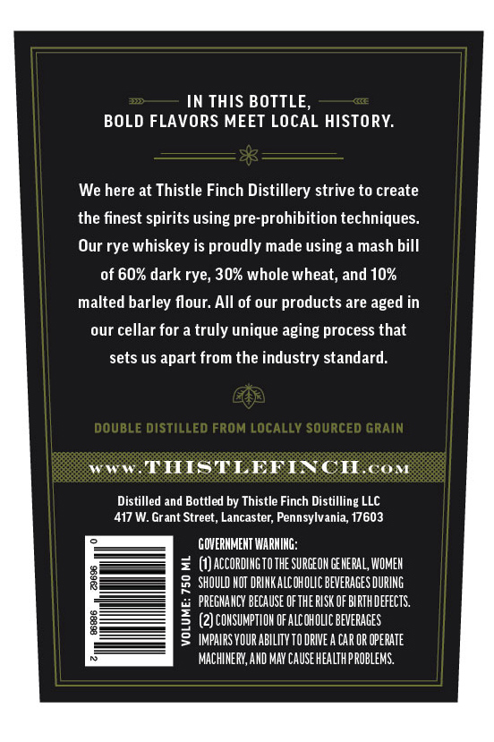
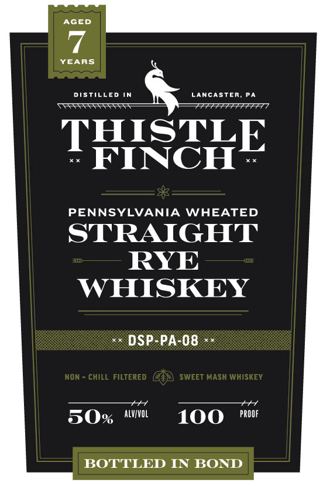
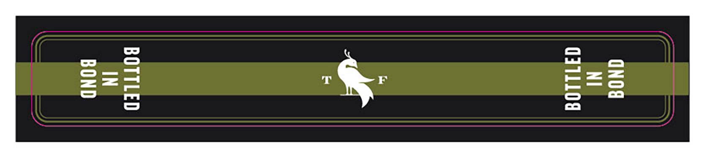

# TTB COLA Label Images - TTBID 26076001000113

**Brand Name:** THISTLE FINCH

**Issue Date:** 03/17/2026

**Origin Code:** 39

**Product Class/Type:** 112

**Source:** [TTB Public COLA Registry](https://ttbonline.gov/colasonline/viewColaDetails.do?action=publicFormDisplay&ttbid=26076001000113)

## Label Images

### Back Label

### Front Label

### Label 3

## Extracted Label Text

*Text extracted via OCR - may contain errors*

*1 image(s) excluded: text did not meet readability threshold*

**Detected Proof:** 100

### Back Label

IN THIS BOTTLE,
BOLD FLAVORS MEET LOCAL HISTORY:
We here at Thistle Finch Distillery strive to create
the finest spirits using pre-prohibition techniques_
Our rye whiskey is proudly made using a mash bill
of 60% dark rye; 30% whole wheat; and 10%
malted barley flour: All of our products are aged in
our cellar for a truly unique aging process that
sets us apart from the industry standard:
DOUBLE DISTiLLed FROM LocaLLV Sourced GRAIN
THISTLEFI CHcoM
Distilled and Bottled by Thistle Finch Distilling LLC
417 W. Grant Street, Lancaster; Pennsylvania, 17603
GOVERHMEHT WARHIHG:
(Jaccordihg TO THE SURGEOH GEHERAL, WOMEH
1
SHOULD HOT DRIHKALCOHOLIC BEVERAGES DURING
PREGHAHCY BECAUSE OF THE RISK OF BIRThDEFEcTS.
1
(2) COHSUMPTLOH OFALCOHOLIC BEVERAGES
IMPAIRS VOUR abILITV TO DRIVE A Car OR OpeRATe
MAchIHERY, AHD MAY CauSe hEaLthPROBLEMS

### Front Label

AGED
YEARS
DISTILLED IN
LancASTER
PA
THISTLE
FINCH
PENNSYLVANIA
WHEATED
STRAIGHT
RYE
WHISKEY
DSP-PA-08
NON
CHILL FilteRED
SWEET MASH WHISKEY
50%
alvvol
100
PROOF
BOTTLED IN BOND
