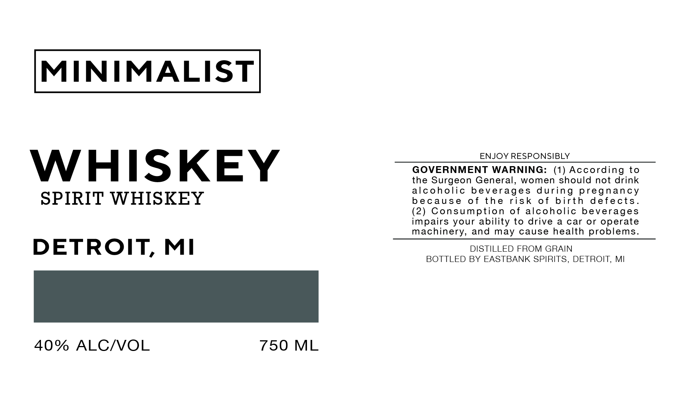

# TTB COLA Label Images - TTBID 26076001000119

**Brand Name:** MINIMALIST

**Issue Date:** 04/03/2026

**Origin Code:** 06

**Product Class/Type:** 147

**Source:** [TTB Public COLA Registry](https://ttbonline.gov/colasonline/viewColaDetails.do?action=publicFormDisplay&ttbid=26076001000119)

## Label Images

### Label 1

## Extracted Label Text

*Text extracted via OCR - may contain errors*

**Detected Proof:** 80

### Label 1

MINIMALIST

ENJOY RESPONSIBLY

GOVERNMENT WARNING: (1) According to

WHISKEY

the Surgeon General, women should not drink

alcoholic beverages during pregnancy

SPIRIT WHISKEY

because of the risk of birth defects.

(2) Consumption of alcoholic beverages

impairs your ability to drive a car or operate

machinery, and may cause health problems.

DISTILLED FROM GRAIN

DETROIT, MI

BOTTLED BY EASTBANK SPIRITS, DETROIT, MI

40% ALC/VOL

750 ML
