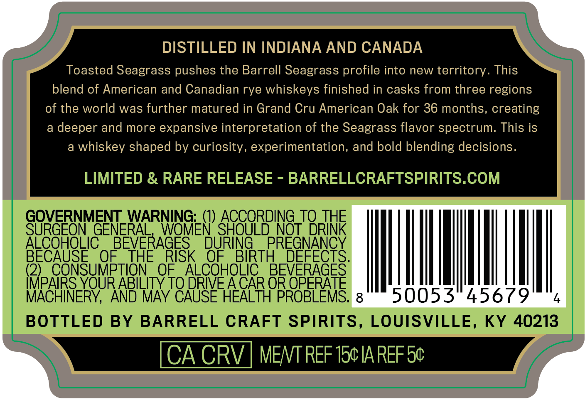
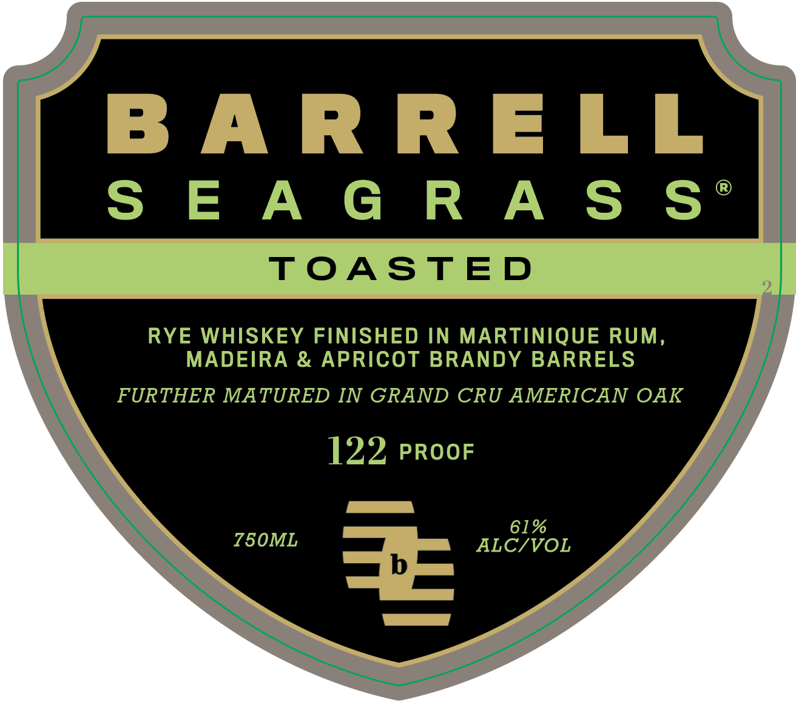

# TTB COLA Label Images - TTBID 26076001000170

**Brand Name:** BARRELL SEAGRASS TOASTED

**Issue Date:** 03/20/2026

**Origin Code:** 22

**Product Class/Type:** 142

**Source:** [TTB Public COLA Registry](https://ttbonline.gov/colasonline/viewColaDetails.do?action=publicFormDisplay&ttbid=26076001000170)

## Label Images

### Back Label

### Front Label

### Label 3

## Extracted Label Text

*Text extracted via OCR - may contain errors*

*1 image(s) excluded: text did not meet readability threshold*

**Detected Proof:** 122

### Back Label

DISTILLED IN INDIANA AND CANADA
Toasted Seagrass pushes the Barrell Seagrass profile into new territory. This
blend of American and Canadian rye whiskeys finished in casks from three regions
of the world was further matured in Grand Cru American Oak for 36 months, creating
a
deeper and more expansive interpretation of the Seagrass flavor spectrum: This is
a
whiskey shaped by curiosity, experimentation, and bold blending decisions
LIMITED & RARE RELEASE
BARRELLCRAFTSPIRITS.COM
GOVERNMENT WARNING: (I) ACCORDING_TQ THE
SURGEON GENERAL
WOMEN' SHOULD NOT DRINK
ALCOHOLIC
BEVERAGES'
DURING
PREGNANCY
BECAUSE
OF
THE
RISK
OF
BIRTH
DEFECTS_
(2)
CONSUMPTION
OF
ALCOHOLIC
BEVERAGES
IMPAIRS YOUR ABILITY TO DRIVE ACAR OR OPERATE
MACHINERY,
AND MAY CAUSE HEALTH PROBLEMS;
8
50053
45679
BOTTLED BY
BARRELL CRAFT SPIRITS, LOUISVILLE, KY 40213
CA CRV
MENT REF 150 IA REFSc

### Front Label

BARRELL

SEAGRAS§S S*

TOASTED

RYE WHISKEY FINISHED IN MARTINIQUE RUM,

MADEIRA & APRICOT BRANDY BARRELS

FURTHER MATURED IN GRAND CRU AMERICAN OAK

122, PROOF

61%

ALC/VOL
