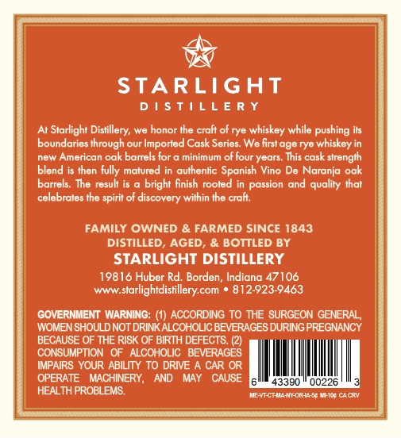
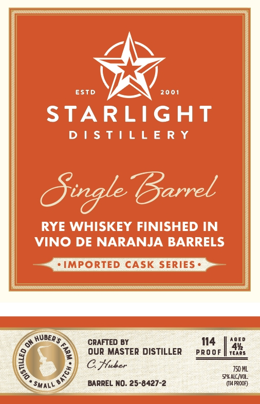

# TTB COLA Label Images - TTBID 26076001000176

**Brand Name:** STARLIGHT DISTILLERY

**Fanciful Name:** SINGLE BARREL

**Issue Date:** 03/17/2026

**Origin Code:** 19

**Product Class/Type:** 142

**Source:** [TTB Public COLA Registry](https://ttbonline.gov/colasonline/viewColaDetails.do?action=publicFormDisplay&ttbid=26076001000176)

## Label Images

### Back Label

### Front Label

## Extracted Label Text

*Text extracted via OCR - may contain errors*

### Back Label

—

&

STARLIGHT

DISTILLERY

At Starlight Distillery, we honor the craft of rye whiskey while pushin

boundaries through our Imported Cask Series. We first age rye whisk

new American oak barrels for @ minimum of four years. This cask strength

blend is then fully matured in authentic Sponish Vino De Noranja ook

|

barrels. The resul

a bright finish rooted in passion and quality that

celebrates the spirit of discovery within the craf

i

FAMILY OWNED & FARMED SINCE 1843

DISTILLED, AGED, & BOTTLED BY

STARLIGHT DISTILLERY

1981

B

luber Rd. Borden, Indiana 47106

-www.starlighidisillery.com * 812-923-9463

GOVERNMENT WARNING: (1) ACCORDING TO THE SURGEON GENERAL,

WOMEN SHOULD NOT DRINK ALCOHOLIC BEVERAGES DURING PREGNANCY

BECAUSE OF THE RISK OF BIRTH DEFECTS. (2).

CONSUMPTION OF ALCOHOLIC BEVERAGES

IMPAIRS YOUR ABILITY TO DRIVE A CAR OR

OPERATE MACHINERY, AND MAY CAUSE Pull Peet ylrnpzal

HEALTH PROBLEMS.

AEVECTAMANORSASy MEO CACY

4

—

cooogre ee ERASE

### Front Label

ESTD
20 01
STARLIGHT
D | $ t | L L E R Y
Sigle Barrel
RYE WHISKEY FINISHED IN
VINO DE NARANJA BARRELS
IMPORTED CASK SERIES
HubER $
CRAFTED BY
114
0E D
Our MASTER DISTILLER
PRo oF
@ Huker
750 ML
5R ALC NC:
BARREL NO: 25-8427-2
(14PROOP)
2
