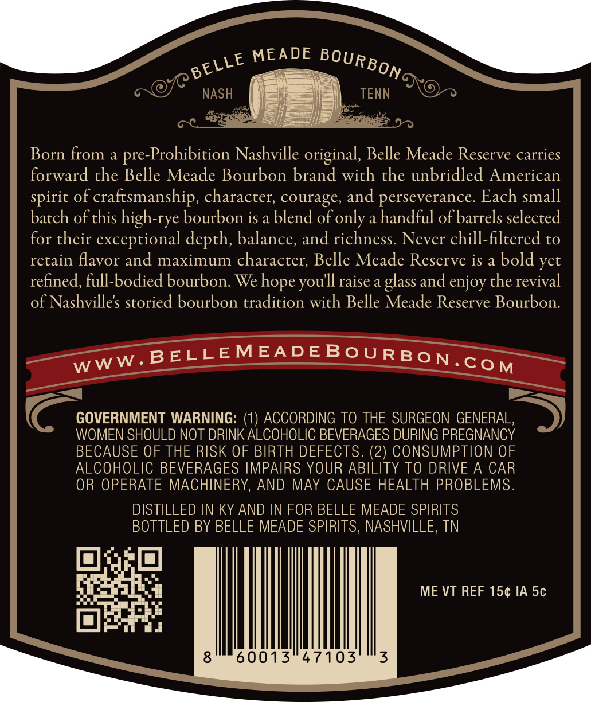
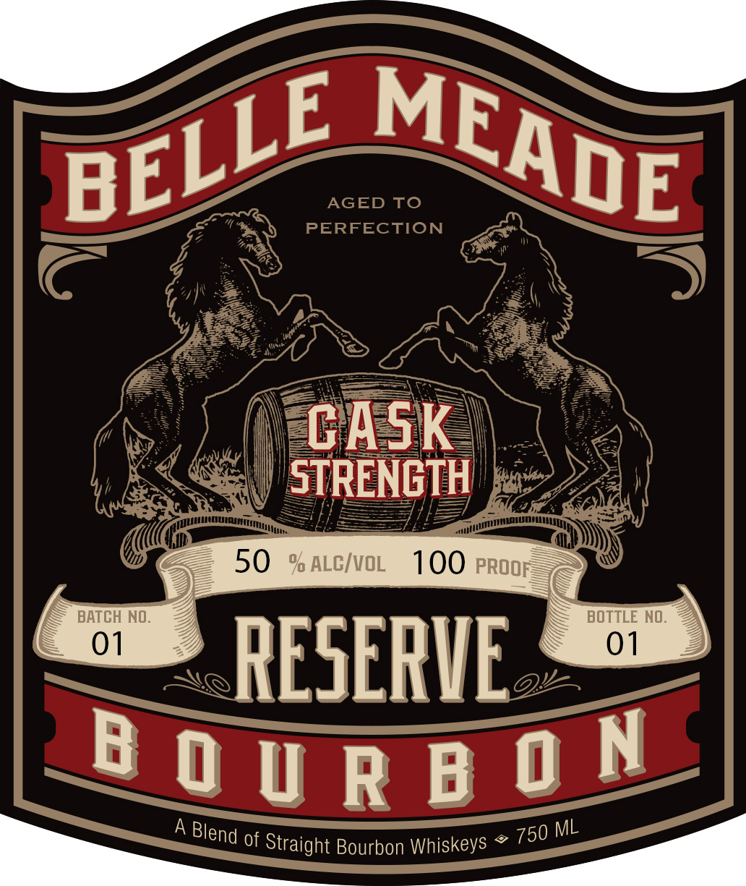
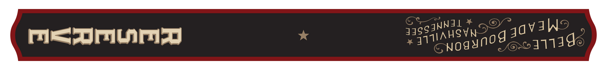

# TTB COLA Label Images - TTBID 26076001000233

**Brand Name:** BELLE MEADE

**Fanciful Name:** RESERVE

**Issue Date:** 03/18/2026

**Origin Code:** 43

**Product Class/Type:** 121

**Source:** [TTB Public COLA Registry](https://ttbonline.gov/colasonline/viewColaDetails.do?action=publicFormDisplay&ttbid=26076001000233)

## Label Images

### Back Label

### Front Label

### Label 3

## Extracted Label Text

*Text extracted via OCR - may contain errors*

*1 image(s) excluded: text did not meet readability threshold*

**Detected Proof:** 100

### Back Label

MEADE
NASH
TENN
Born from a
pre-Prohibition Nashville original, Belle Meade Reserve carries
forward the Belle Meade Bourbon brand with the unbridled American
of craftsmanship, character; courage, and perseverance. Each small
batch of this high-rye bourbon is a blend of only a handful of barrels selected
for their exceptional depth; balance, and richness: Never chill-filtered to
retain favor and maximum character; Belle Meade Reserve is a bold yet
refined, full-bodied bourbon. We
raise a glass and enjoy the revival
of Nashvilles storied bourbon tradition with Belle Meade Reserve Bourbon:
BELLEMEADEBOURBON com
GOVERNMENT WARNING:
ACCORDING TO THE SURGEON GENERAL,
WOMEN SHOULD NOT DRINK ALCOHOLIC BEVERAGES DURING PREGNANCY
BECAUSE OF THE RISK OF BIRTH DEFECTS. (2) CONSUMPTION OF
ALCOHOLIC BEVERAGES IMPAIRS YOUR ABILITY TO DRIVE A CAR
OR OPERATE MACHINERY, AND MAY CAUSE HEALTH PROBLEMS.
DISTILLED IN KY AND IN FOR BELLE MEADE SPIRITS
BOTTLED BY BELLE MEADE SPIRITS, NASHVILLE, TN
ME VT REF 154 IA 5c
8
60013
47103
3
BOURBONG
BELLE
spirit
hope
youll
WWW _

### Front Label

AGED
To
PERFECTION
CASK
STRENGTH
50
% ALCIVOL
100 PROOF
BATCH NO
BOTTLE NO.
01
01
RESERIE
B 0 U R B ON
ML
of
Straight Bourbon Whiskeys
MEADE
BELLE
A Blend
750
