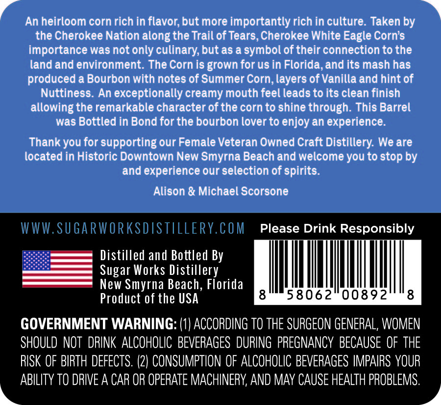
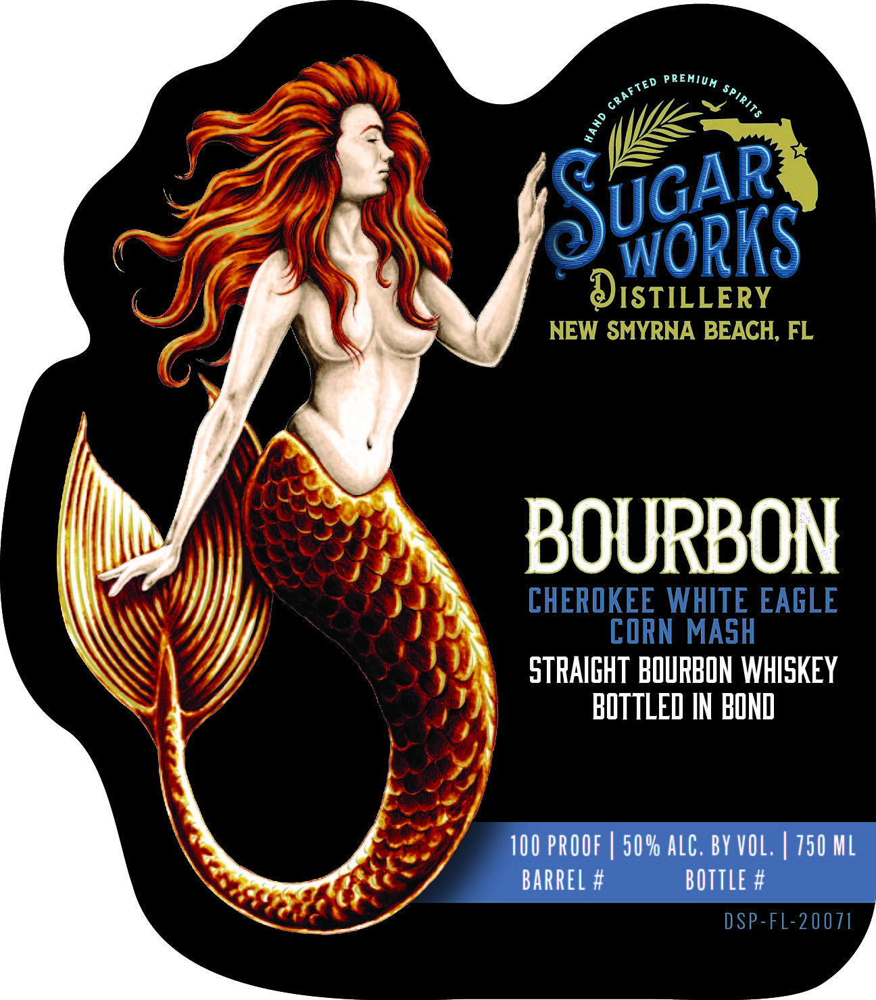

# TTB COLA Label Images - TTBID 26076001000339

**Brand Name:** SUGAR WORKS DISTILLERY BOURBON

**Fanciful Name:** CHEROKEE WHITE EAGLE CORN MASH

**Issue Date:** 03/23/2026

**Origin Code:** 16

**Product Class/Type:** 101

**Source:** [TTB Public COLA Registry](https://ttbonline.gov/colasonline/viewColaDetails.do?action=publicFormDisplay&ttbid=26076001000339)

## Label Images

### Back Label

### Front Label

## Extracted Label Text

*Text extracted via OCR - may contain errors*

**Detected Proof:** 100

### Back Label

a An heirloom corn rich in flavor, but more importantly rich in culture. Taken by »
the Cherokee Nation along the Trail of Tears, Cherokee White Eagle Corn’s
importance was not only culinary, but as a symbol of their connection to the
land and environment. The Corn is grown for us in Florida, and its mash has
produced a Bourbon with notes of Summer Corn, layers of Vanilla and hint of
Nuttiness. An exceptionally creamy mouth feel leads to its clean finish
allowing the remarkable character of the corn to shine through. This Barrel
was Bottled in Bond for the bourbon lover to enjoy an experience.

Thank you for supporting our Female Veteran Owned Craft Distillery. We are
located in Historic Downtown New Smyrna Beach and welcome you to stop by
and experience our selection of spirits.

Alison & Michael Scorsone

Please Drink Responsibly

Distilled and Bottled By
Sugar Works Distillery
New Smyrna Beach, Florida
Product of the USA

GOVERNMENT WARNING: (1) ACCORDING TO THE SURGEON GENERAL, WOMEN
SHOULD NOT DRINK ALCOHOLIC BEVERAGES DURING PREGNANCY BECAUSE OF THE

RISK OF BIRTH DEFECTS. (2) CONSUMPTION OF ALCOHOLIC BEVERAGES IMPAIRS YOUR
ABILITY TO DRIVE A CAR OR OPERATE MACHINERY, AND MAY CAUSE HEALTH PROBLEMS.

### Front Label

WORKS
ISTILLERY
NEW SMYRNA BEACH, FL
BOURBON
CHEROKEE WHITE EAGLE
CORN MASH
100 PROOF
50 % alc, BY VOL,
750 ML
barrel #
bOTTLe #
DSP-FL-20071
PREMIUM
CRAFTED
SPIRITs
1
UGAR
