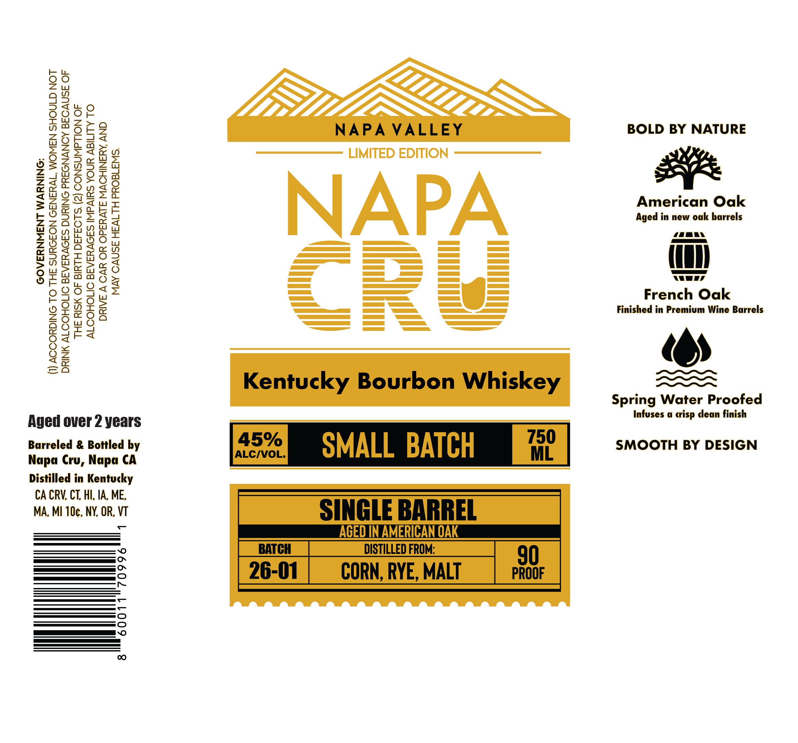

# TTB COLA Label Images - TTBID 26076001000518

**Brand Name:** NAPA CRU KENTUCKY BOURBON WHISKEY

**Issue Date:** 03/19/2026

**Origin Code:** 22

**Product Class/Type:** 141

**Source:** [TTB Public COLA Registry](https://ttbonline.gov/colasonline/viewColaDetails.do?action=publicFormDisplay&ttbid=26076001000518)

## Label Images

### Label 1

## Extracted Label Text

*Text extracted via OCR - may contain errors*

**Detected Proof:** 90
**Detected Age:** 2 Years

### Label 1

2
0i
562
2
NAPA VALLEY
BOLD BY NATURE
8
I
8
1
LIMITED EDITION
W
@
2
1
NAPA
Agedierican bOak
Oak
K
8
3
2
3
2
6
4
2
French Oak
M
Finished in Premium Wine Barrels
1
3
=
Kentucky Bourbon Whiskey
Spring Water Proofed
Infuses 4
dlean finish
Aged over 2 years
Barreled & Bottled by
45%
SMALL BATCH
750
SMOOTH BY DESIGN
Napa
Napa CA
ALCIVOL.
ML
Distilled in Kentucky
CA CRV; CT, HI, IA, ME,
MA, MI 10c, NY, OR, VT
SINGLE BARREL
AGED INAMERICANOAK
BATCH
DISTILLED FROM:
90
2
26-01
CORN; RYE, MALT
PROOF
6
8
0
crisp
Cru,
