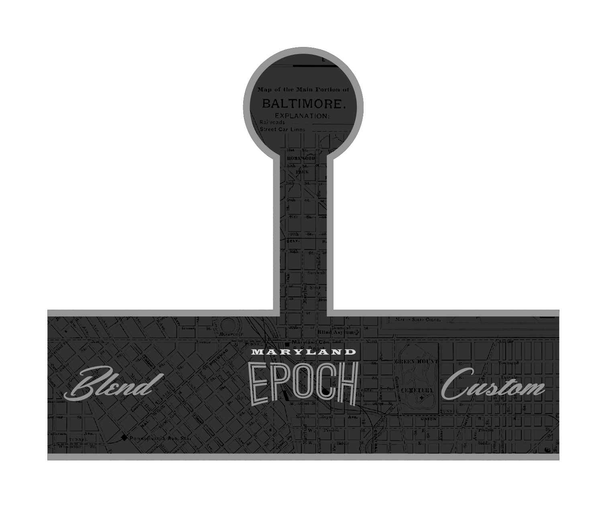
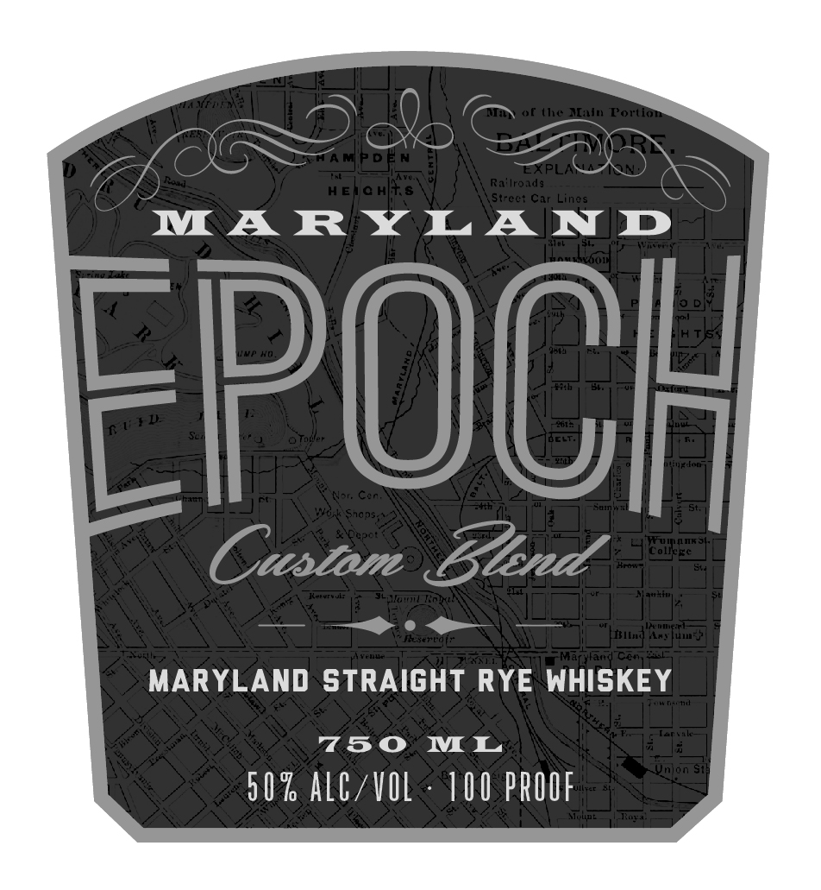

# TTB COLA Label Images - TTBID 26076001000531

**Brand Name:** EPOCH

**Issue Date:** 03/18/2026

**Origin Code:** 25

**Product Class/Type:** 102

**Source:** [TTB Public COLA Registry](https://ttbonline.gov/colasonline/viewColaDetails.do?action=publicFormDisplay&ttbid=26076001000531)

## Label Images

### Back Label

### Front Label

### Label 4

## Extracted Label Text

*Text extracted via OCR - may contain errors*

*1 image(s) excluded: text did not meet readability threshold*

**Detected Proof:** 100

### Back Label

Nap2
Df(lie Malw Fortlot
BALTIMORE.
EXPLANATION:
R.' rc.Ids
Streel Car Lines
n opuiaanddm
Ka
H
COLcE
Kaueh
(KIwda
Mull}
MarxardCer1
Aecal
MARYLAND
KCREiS] dltd
Bend
EPOCH
CEAFTEIL
Custon
a
14
Pepnex anii
Hine
5.1'

### Front Label

f (t NLalu Portion
Ra' Iro1dg
HEJe H
Strect Cir Lines
MA RYLAIND
POCh
NR
Cac
Sncn52
Maennnekam
Custom
3nd
colles
ELplouu
Koh
Wcp H
TEILuud
Martrand Ch
MARYLAND STRAIGHT RYE WHISKEY
e
750
ML
Wnion Si
5 0 % alg/VOL
100 PROOF
Ailde
t} D
Cc ,
o>
W
