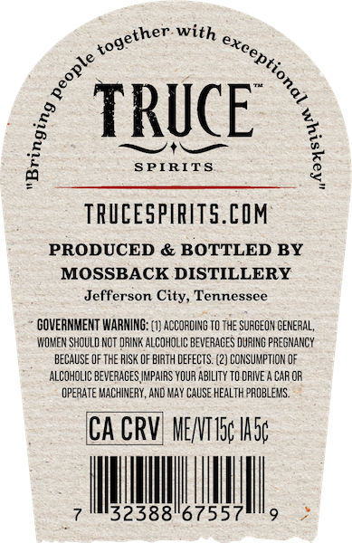
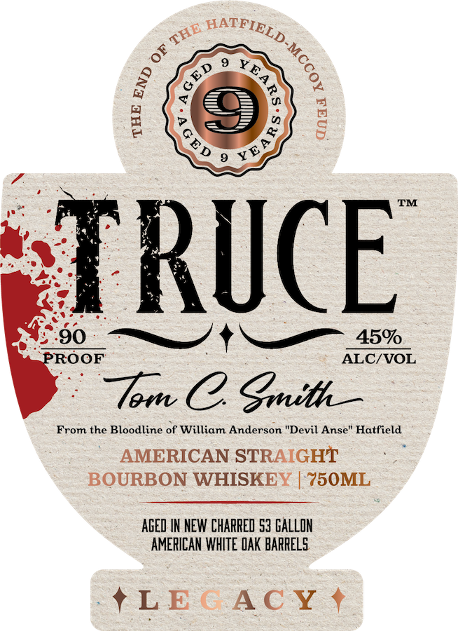

# TTB COLA Label Images - TTBID 26076001000544

**Brand Name:** TRUCE

**Issue Date:** 03/18/2026

**Origin Code:** 43

**Product Class/Type:** 101

**Source:** [TTB Public COLA Registry](https://ttbonline.gov/colasonline/viewColaDetails.do?action=publicFormDisplay&ttbid=26076001000544)

## Label Images

### Back Label

### Front Label

## Extracted Label Text

*Text extracted via OCR - may contain errors*

**Detected Proof:** 90

### Back Label

TRUCE
SPIRITS
8
TRUCESPIRITS.CIM
PRODUCED & BOTTLED BY
MOSSBACK DISTILLERY
Jefferson City, Tennessee
GOVERNMENT WARNING:
ACCOFDING TO THE SUFGEOY GENERAL,
WOWEM SHQULD NCT DRINK ALCOHDLIC beverages DUING PREGMANCY
BECAUSE OF THE RISK OF EIRTH DEFECTS: (2] CONSUWPTION OF
ALCOHOLIC BEVERAGES IMPAIRS YOUR AbLITy TO DRIVE A CAR OR
QperATe WACHIMERY, AND WaY CAUSE health PROBLEWS.
CA CRVI MENTISp Ha5
32388"67557
with
together
exceptiona
ople
0
6
1

### Front Label

6
F
9
8
Y
TRUCE
90
45%
PROOF
ALC/ VOL
Tom C gmith_
From the Bloodline of William Anderson "Devil Anse" Hatfield
AMERICAN STRAIGHT
BOURBON WHISKEY
75OML
AGED IN NEW CHARRED 53 GALLON
AMERICAN WHITE QAK BARRELS
LE ( AC Y
HATFIELD
THE
1
1
GED
8
3
