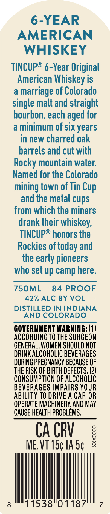
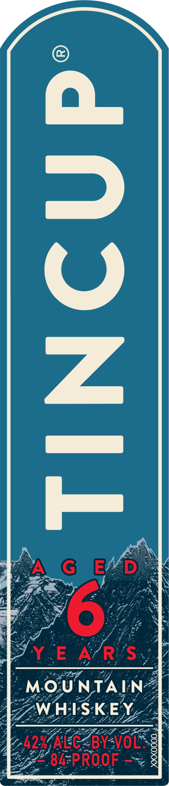
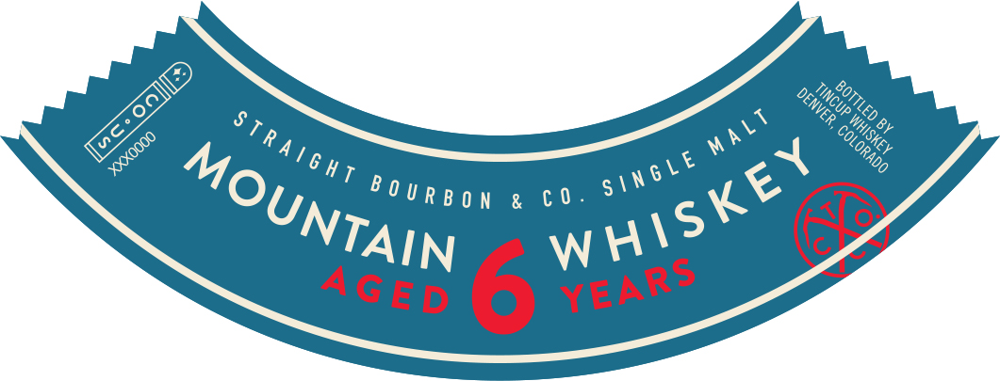

# TTB COLA Label Images - TTBID 26076001000585

**Brand Name:** TINCUP

**Issue Date:** 03/18/2026

**Origin Code:** 13

**Product Class/Type:** 140

**Source:** [TTB Public COLA Registry](https://ttbonline.gov/colasonline/viewColaDetails.do?action=publicFormDisplay&ttbid=26076001000585)

## Label Images

### Back Label

### Front Label

### Label 3

## Extracted Label Text

*Text extracted via OCR - may contain errors*

*2 image(s) excluded: text did not meet readability threshold*

**Detected Proof:** 84

### Back Label

6-YEAR
AMERICAN
WHISKEY
tincUpe 6-Year Original
American Whiskey is
a
marriage of Colorado
single malt and straight
bourbon, each aged for
a
minimum of six years
in new charred oak
barrels and cut with
Rocky mountain water:
Named for the Colorado
mining town of Tin
and the metal cups
from which the miners
drank their whiskey;
TIncUp@ honors the
Rockies of today and
the early pioneers
who set up camp here:
75OML
84 PROOF
42% ALC BY VOL
DISTILLED IN INDIANA
AND COLORADO
GOVERNMENT WARNING: (1)
ACCORdingTOTHE SURGEON
GENERAL; WOMEN SHOULD NOT
DRINK ALCOHOLIC BEVERAGES
DURING PREGNANCY BECAUSE OF
THE RISK OF BIRTH DEFECTS, (2)
CONSUMPTION OF ALCOHOLIC
BEVERAGES IMPAIRS YOUR
ABILITY TO DRIVE A CAR OR
OPERATE MACHINERY,AND MAY
CAUSE HEALTH PROBLEMS,
CA CRV
1
ME, VT I5c IA 5c
8
11538"01187
Cup
