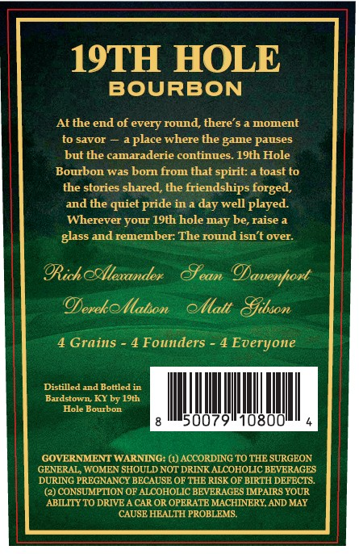
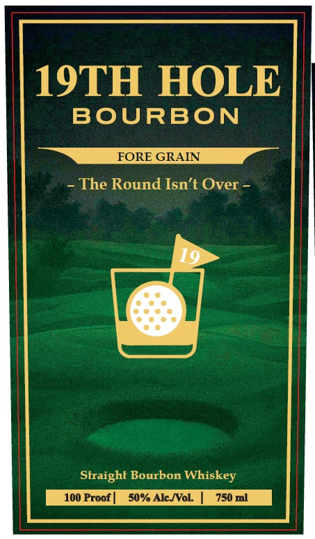

# TTB COLA Label Images - TTBID 26076001000629

**Brand Name:** 19TH HOLE BOURBON

**Issue Date:** 03/23/2026

**Origin Code:** 22

**Product Class/Type:** 101

**Source:** [TTB Public COLA Registry](https://ttbonline.gov/colasonline/viewColaDetails.do?action=publicFormDisplay&ttbid=26076001000629)

## Label Images

### Back Label

### Label 1

### Label 2

## Extracted Label Text

*Text extracted via OCR - may contain errors*

*1 image(s) excluded: text did not meet readability threshold*

**Detected Proof:** 100

### Back Label

19TH HOLE
BOURBON
At the end of every round, there'$ & moment
to savor
where the game pauses
but the camaraderie continues. 19th Hole
Bourbon was born from that spirit:
toast to
the stories shared, the friendships forged,
and the quiet pride in a
well played.
Wherever your 19th hole may be, raise
glass
remember: The round isn't over:
@Rich ocllexander
eamn
@avenfort
OerekoIlatson
ollattSfibson
Grains
4 Founders
4 Everyone
Distilled and Bottled in
Bardstown KY by 19th
Hole Bourbon
500
108
GOVERNMENT WARNING: (1) ACCORDING TO THE SURGEON
GENERAL WOMEN SHOULD NOT DRINK ALCOHOLIC BEVERAGES
DURING PREGNANCY BECAUSE OF THE RISK OF BIRTH DEFECTS
(2) CONSUMPTION OF ALCOHOLIC BEVERAGES IMPAIRS YOUR
ABILITY TO DRIVE
CAR OR OPERATE MACHINERY AND MAY
CAUSE HEALTH PROBLEMS
aplace
day `
aid

### Label 1

19TH HOLE
BOURBON
FORE GRAIN
The Round Isn't Over
19
Straight Bourbon Whiskey
100 Proof
so% Alc Wol
750 ml
