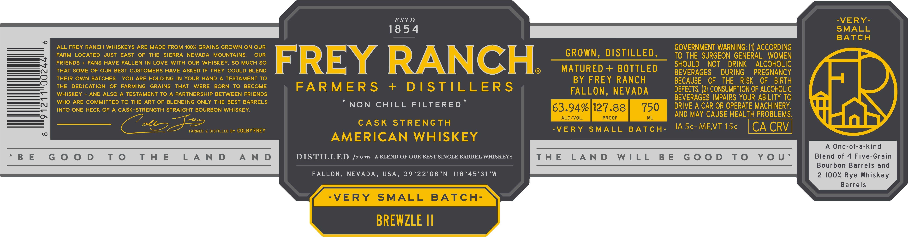

# TTB COLA Label Images - TTBID 26076001000924

**Brand Name:** FREY RANCH FARMERS + DISTILLERS

**Issue Date:** 03/18/2026

**Origin Code:** 32

**Product Class/Type:** 140

**Source:** [TTB Public COLA Registry](https://ttbonline.gov/colasonline/viewColaDetails.do?action=publicFormDisplay&ttbid=26076001000924)

## Label Images

### Back Label

## Extracted Label Text

*Text extracted via OCR - may contain errors*

### Back Label

ESTD
VERY-
18 5 4
SMALL
BATCH
ALL FREY RANCH WHISKEYS ARE MADE FROM 100% GRAINS GROWN ON OUR
GOVERNMENT WARNING: (1) ACCORDING
FARM LOCATED
JUST EAST OF
THE SIERRA
NEVADA
MOUNTAINS:
OUR
GROWN ,
DISTILLED ,
To THE SURGEON GENERAL,
WOMEN
FRIENDS
FANS HAVE FALLEN
IN
LOVE WIth OUR WHISKEY,
SO
MUCH
SO
FREY RANCH
SHOULD
NOT
DRINK
ALCOHOLIC
THAT SOME OF Our BEST CUSTOMERS HAVE ASKED IF THEY COULD BLEND
MATURED + BOTTLED
BEVERAGES
DURING
PREGNANCY
THEIR OWN BATCHES.
YOU ARE HOLDING IN YOUR HAND A TESTAMENT TO
BY FREY RANCH
BECAUSE
OF
THE
RISK
OF
BIRTH
The
DEDICATION
OF  FARMING
GRAINS
THAT
WERE
BORN To BECOME
FARMERS
+
D /S TILLERS
DEFECTS; (2) CONSUMPTION OF ALCOHOLIC
WHISKEY
AND ALSO A TESTAMENT TO A PARTNERSHIP BETWEEN FRIENDS
FALLON, NEVADA
BEVERAGES IMPAIRS YOUR ABILITY TO
WHO ARE COMMiTTED To THE ART OF BLENDING ONLY THE BEST BARRELS
NON
CHILL
FILTERED
DRIVE A CAR OR OPERATE MACHINERY,
INTO ONE HECK OF A
CASK-STRENGTH STRAIGHT BOURBON WHISKEY.
63.94%/127.88
750
ALC/VOL_
PROOF
ML
AND MAY CAUSE HEALTH PROBLEMS
FARMED
DISTILLED BY COLBY FREY
CASK
STRENGTH
-VER Y
SMALL
B A TcH-
IA 5c-ME,VT 15c
CA CRV
AMERICAN WHISKEY
A One-of-a-kind
B E
G 0 0 D
T 0
T H E
L A N D
A N D
DISTILLED from
BLEND OF OUR BEST SINGLE BARREL WHISKEYS
T h E
L A N D
W |L L
B E
G 0 0 D
T 0
Y 0 U '
Blend of
4 Five-Grain
Bourbon Barrels and
FALLON, NEVADA, USA, 39022'08"N
118 945'31"W
2 100% Rye Whiskey
Barrels
VERY
SMALL
BATCH-
BREWZLE I
