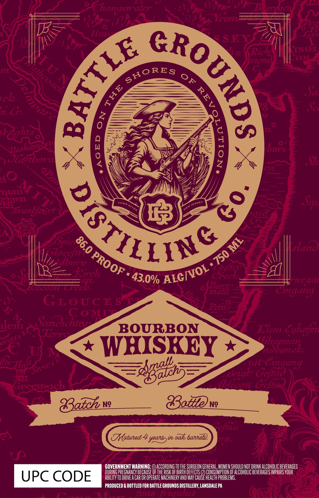

# TTB COLA Label Images - TTBID 26077001000041

**Brand Name:** BATTLE GROUNDS DISTILLING CO.

**Issue Date:** 03/18/2026

**Origin Code:** 39

**Product Class/Type:** 141

**Source:** [TTB Public COLA Registry](https://ttbonline.gov/colasonline/viewColaDetails.do?action=publicFormDisplay&ttbid=26077001000041)

## Label Images

### Label 1

## Extracted Label Text

*Text extracted via OCR - may contain errors*

**Detected Proof:** 86

### Label 1

3
Clugen aier
'PC
Z1izi
S EY
%o
Ricl
FILTC?
nelc
Sczz
ak
L
0
Tz G:
laoibox
Xi
1
lirL
S71
Ue
0
TIITT
THTFTI
runlyiort
A
lazid
Kla
Allrt"1
17
Eorch
Creck
CCCon
1etve1
(Tiaizl
1710 LJ41
K
Citgur
M
GLoucE s
Icttz
CONTI
arcchtzt
VET7
BOURBON
Klm
Cglutfei
TI
N
WHISKEY
>ihtank
"Gdiagung
Grcemach
Hhecan Gcfux
Batch
Ng
8tte
Ng
ftcu
A
Tatued 4 yeanssir aaks baneln)
V7l]
Eiiiiiii
GOVERNMENT WARNING: €
ACCORDING TOTHE SURGEON GENERAL, WOMEN SHOULD NOT DRINK ALCOHOLIC BEVERAGES
DURING PREGNANCY BECAUSE OfThe RISK OF BIRTH DEFECTS (2) CONSUMPTLON QF ALCOHOLIC BEVERAGES IMPAIRS YOUR
UPC CODE
ABILITY TO DRIVE A CAR OR OPERATE MACHINERY AND MAV CAUSe HEALTh PROBLEMS;
PRODUCED & BOTTLED FOR BATTLE GROUNDS DISTILLERY, LANSDALE PA
Funa F UTLuf
Veu
)
6
U N
SHORES
cacl
0F
1
0
TD(
8
Vrdphtx
Victhama
MI TC
RGT1LSG
8
Squ
JERSEY
ToMs
RIVER
NEW
Spe 860
ML
Gcfie
750
PROOF
ALC/VOL "
2
43.0%
plerh
HIL (
VC
Egad5
Z4t (
~aLl" (
Brigl_
