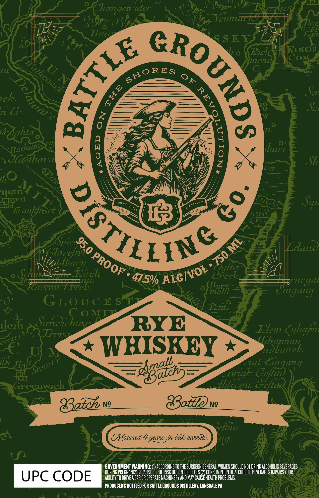

# TTB COLA Label Images - TTBID 26077001000042

**Brand Name:** BATTLE GROUNDS DISTILLING CO.

**Issue Date:** 03/18/2026

**Origin Code:** 39

**Product Class/Type:** 142

**Source:** [TTB Public COLA Registry](https://ttbonline.gov/colasonline/viewColaDetails.do?action=publicFormDisplay&ttbid=26077001000042)

## Label Images

### Label 1

## Extracted Label Text

*Text extracted via OCR - may contain errors*

**Detected Proof:** 95

### Label 1

Jeie
404
Clugen'aier
Jj
K
Veum
llizi
SEY
ll o
Ricl
LINcs
Coa
nntcn
Sc
ch
nz G::
S
Jlbibon
EZ
Xi
hurz
S7
1
hO
TTATl
Syji
Irunlyibrt
A
ilazzd
Kiloe
Wvlnry
'cftcz
R_Zoch
Creck
LL
Jncqal
aon
Ereck
{Tai
Ciung
"LY"
GLoucrsy
Etlz
4
C oMIT
lerf
Sarcuchtty
RYE
Klm Cxluzfen
Trz
C€
WHISKEY
Mihlanak
(fiz IIAl
Eaga053
priql
"Gefiagang
Grcemich
Mhlecon Gcfuk
Batch
Ng
{tteve
eftuu
1
TMatued 4 yeatsyin oaks bateln)
F14]
Lanana
GOVERNMENT WARNING: €
ACCORDING TO THE SURGEON GENERAL, WOMEN SHOULD NOT DRINK ALCOHOLIC BEVERAGES
DURING PREGNANCY BECAUSE Of THE RISK OF BIRTH DEFECTS (2) CONSUMPTION OF ALCOHOLIC BEVERAGES IMPAIRS VOUR
UPC CODE
ABILITV TO DRIVEA CaR OR OPERATe MACHINERV AND May CAUSE HEALTh PROBLEMS.
PRODUCED & BOTTLED FOR BATTLE GROUNDS DISTILLERY, LANSDALEPA
Funa hufwuf
)
6
U N
1lcuack
SHORES
0F
#
0
)
D(
8
Vrdghtx
Vlctkzam
huM T 1
QGT1LSY
8
JERSEY
TOMS
RIVER
NEW
{Spic 950
ML
cefh
750
PROOF
ALCIVOL "
47.5%
SI(L
zyt (
~Sa"ll' (
Vrc
