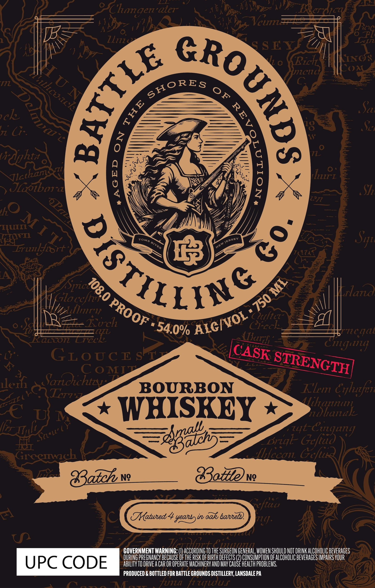

# TTB COLA Label Images - TTBID 26077001000043

**Brand Name:** BATTLE GROUNDS DISTILLING CO.

**Issue Date:** 03/18/2026

**Origin Code:** 39

**Product Class/Type:** 141

**Source:** [TTB Public COLA Registry](https://ttbonline.gov/colasonline/viewColaDetails.do?action=publicFormDisplay&ttbid=26077001000043)

## Label Images

### Label 1

## Extracted Label Text

*Text extracted via OCR - may contain errors*

**Detected Proof:** 108

### Label 1

a
Chumgenaicr
Vcum
ZLizi
S S EY
Ii 0
Ricl
LINC:
ze11
COa(
Scz
@k
L
Jz G:.
rdghti
1
lur_
) JLobora
X
S7z
hO
Irunlyirt
A
Uloccfho
Tlazd
Iollmry
Otftcz
R_Koch
CFcc
LL
Frncgal
kaccon
TEek
LL
Citun
"LYa
GLoucr
LL
X
C oMTT
llerf
Sariochtz
BOURBON
Klm Crluzfer
TTz
Aihannin
C€
WHISKEY
h hanal
74330)3
"Gefiag
LTLI]
Grcemaich
Hhccons
Batch
Ng
8tevg
4
Hatued 4 yeatsyin aaks baneld
F7u]
oyoononkintotuc cunaconcticdi ,
GOVERNMENT WARNING: (U) ACCORDING TO THE SURGEON GENERAL, WOMEN SHOULD NOT DRINK ALCOHOLIC BEVERAGES
DURING PREGNANCY BECAUSE Of THE RISK Of BIRTH DEFECTS (2) CONSUMPTION OF ALCOHOLIC BEVERAGES IMPAIRS VOUR
UPC CODE
ABILITY TO DRIVE A CAR OR OPERATE MACHINERY AND May CAUSE heaLTh PROBLEMS
PRODUCED & BOTTLED FOR BATTLE GROUNDS DISTILLERY, LANSDALEPA
ANA
Funa
hutwuf
)
6
Iu N
llcuach
SHORES
0F
1
0
ID(
8
8
1
Vlatzam
QuM T 2'
RGTILSY
8
Sq"
JETl
JERSEY
TOMS
RIVER
NEW
2
ML
Spcto_
750
PROOF
ALCIVOL "
54.0%
llarh
shn
CASK
STRENGTH
ZII (
Uli
z4t
haLl"
Brigl_
Gcfu
ficz
