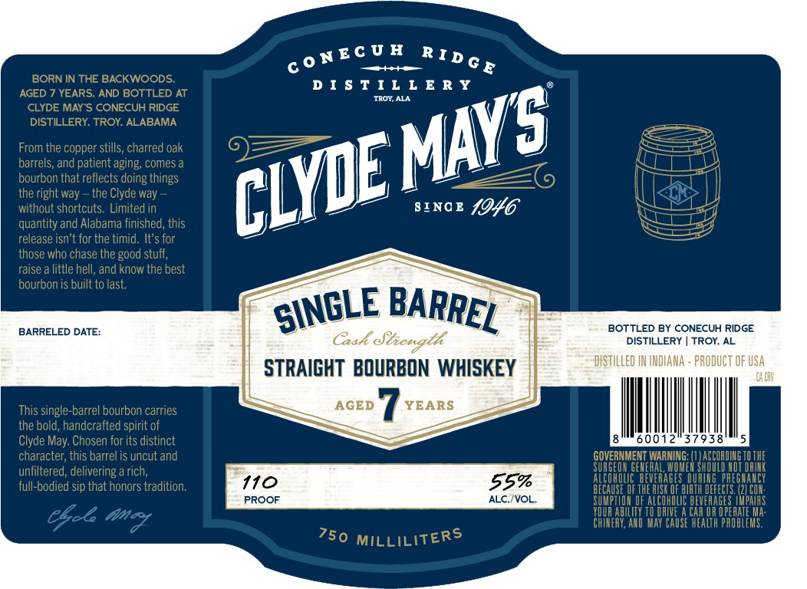

# TTB COLA Label Images - TTBID 26077001000217

**Brand Name:** CLYDE MAY'S

**Issue Date:** 03/18/2026

**Origin Code:** 10

**Product Class/Type:** 101

**Source:** [TTB Public COLA Registry](https://ttbonline.gov/colasonline/viewColaDetails.do?action=publicFormDisplay&ttbid=26077001000217)

## Label Images

### Label 1

### Label 2

## Extracted Label Text

*Text extracted via OCR - may contain errors*

*1 image(s) excluded: text did not meet readability threshold*

### Label 1

BORN IN THE BACKWOODS
D I $ T I L L € R y
AGED
YEARS AND BOTTLED AT
TROY; ALA
CLYDE MAY 5 CONECUH RIDGE
DISTILLERY: TROY ALABAMA
From the copper stills; charred oak
barrels;
patient aging; comes a
bourbon that reflects doing things
9
the right way
the Clyde way
without shortcuts. Limited in
SI NC E
{046
quantity and Alabama finished, this
release isn't for the timid. It's for
those who chase the good stuff,
raise a little hell, and krow the best
bourbon is built to last:
BARRELED DATE:
BOTTLED BY CONECUH RIDGE
Gak &iengtl
DISTILLERY
TROY; AL
DISTILLED IM INDIAMA - PRODUCT OF USA
STRAIGHT  BOURBON WHISKEY
Lr LHV
This single-barrel bourbon carries
AGED
YEARS
the bold, handcrafted spirit of
Clyde May: Chosen for its distinct
60012
37938
character; this barrel is uncut and
GOVERNMENT WARNING:
ACCORDIHG
unfiltered; delivering a rich;
SURGEON GEheFAL,
ShIuLI
HEU#
full-bodied sip that honors tradition:
110
559
HEERNE UF TREHELDE BHUR DEREERE EDEET
PROOF
ALC_{VOL_
F ALC_holIc
HAR HR UFEANEMS
YDUR AbTLITY TO AIVE A
Ma:
Cfok amcy
CHIMERY, AND May CauSe heaLth PAOBLeS.
MILLILITERS
CoNEC U H
RId G E
MAYS
CLYE
and
SINGLE
BARREL
750
