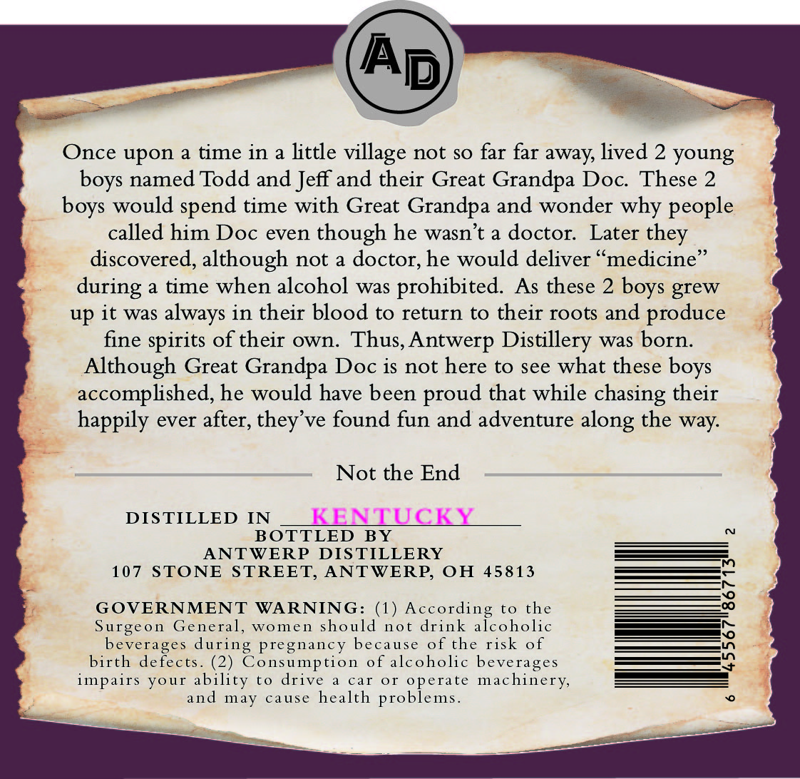
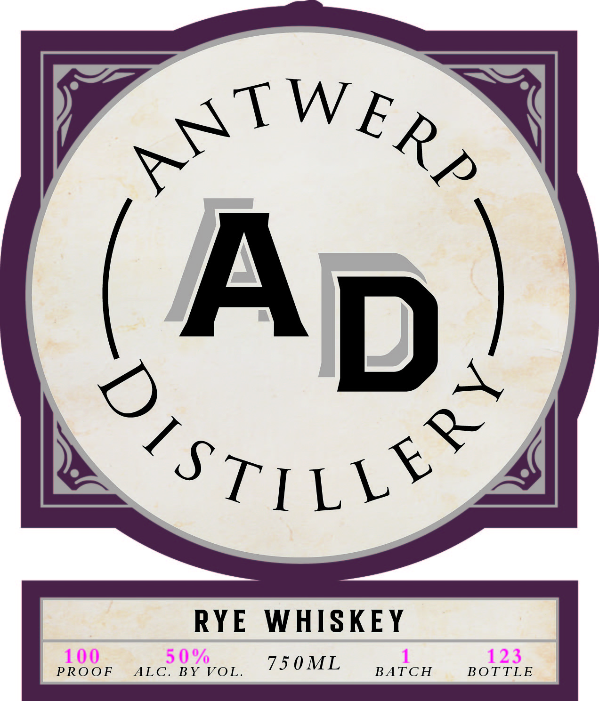

# TTB COLA Label Images - TTBID 26077001000354

**Brand Name:** ANTWERP DISTILLERY

**Issue Date:** 03/19/2026

**Origin Code:** 09

**Product Class/Type:** 102

**Source:** [TTB Public COLA Registry](https://ttbonline.gov/colasonline/viewColaDetails.do?action=publicFormDisplay&ttbid=26077001000354)

## Label Images

### Back Label

### Front Label

## Extracted Label Text

*Text extracted via OCR - may contain errors*

*1 image(s) excluded: text did not meet readability threshold*

### Back Label

Once upon a time in a little
not $0 far far away, lived 2 young
Todd and Jeff and their Great Grandpa Doc These 2
would spend time with Great Grandpa and wonder why people
called him Doc even though he wasn't a doctor:
Later
discovered, although not a doctor; he would deliver
medicine
time when alcohol
was
prohibited. As these 2
grew
up it was
always in their blood to return
to their roots and
produce
fine spirits of their own. Thus,Antwerp Distillery was born.
Although Great Grandpa Doc is not here to see what these
accomplished, he would have been proud that while chasing their
happily ever after;
ve found fun and adventure
the way:
Not the End
DISTILLED IN
KENTUCKY
BOTTLED BY
ANTWERP
DIS TILLERY
107
STONE STREET; ANTWERP, OH 45813
GOVERNMENT
WARNING: (1) According to the
Surgeon
General,
WOme nl
should not drink alcoholic
beverages during pregnancy
because
of the risk of
birth defects
(2) Consumption
of alcoholic beverages
impairs
ability
to
drive
car
01
operate machinery;
and
may
cause
health problems_
village
named
boys
boys
they
during
boys
boys
they'
along
your
