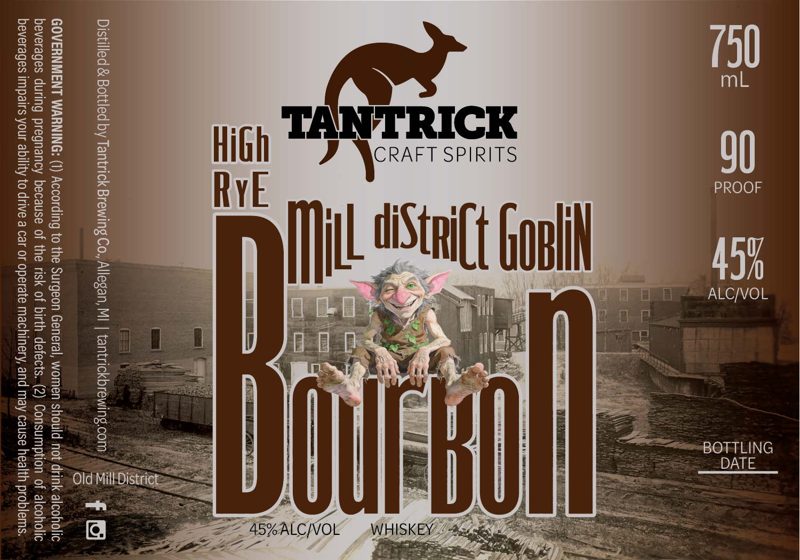

# TTB COLA Label Images - TTBID 26077001000389

**Brand Name:** HIGH RYE MILL DISTRICT GOBLIN BOURBON

**Issue Date:** 03/19/2026

**Origin Code:** 06

**Product Class/Type:** 141

**Source:** [TTB Public COLA Registry](https://ttbonline.gov/colasonline/viewColaDetails.do?action=publicFormDisplay&ttbid=26077001000389)

## Label Images

### Label 1

## Extracted Label Text

*Text extracted via OCR - may contain errors*

### Label 1

mL
PROOF
ALC/VOL
BOTTLING
DATE

SS
Ss

Lt bolt

s&

be
Y
ry
Et

CRAFT SPIRITS

TN
Mi

High
RYE

Distilled & Bottled by Tantrick Brewing Co, Allegan, MI | tantrickbrewing.com

*G

GOVERNMENT WARNING: (1) According to the Surgeon General, women should not drink alcoholic
beverages during pregnancy because of the risk of birth defects. (2) Consumption of alcoholic
beverages impairs your ability to drive a car or operate machinery, and may cause health problems.

Old Mill District
