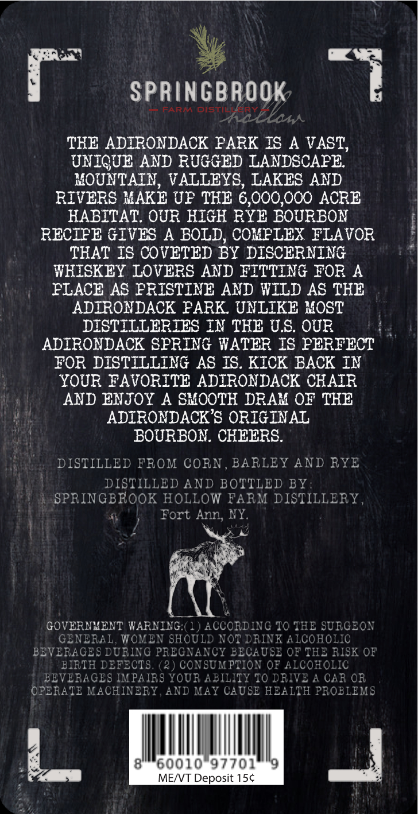
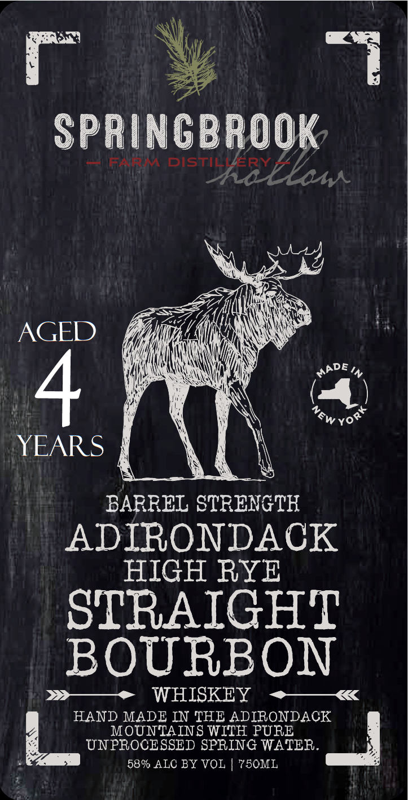

# TTB COLA Label Images - TTBID 26077001000403

**Brand Name:** SPRINGBROOK 4YR

**Fanciful Name:** BSHR4YR

**Issue Date:** 03/19/2026

**Origin Code:** 02

**Product Class/Type:** 101

**Source:** [TTB Public COLA Registry](https://ttbonline.gov/colasonline/viewColaDetails.do?action=publicFormDisplay&ttbid=26077001000403)

## Label Images

### Back Label

### Label 1

## Extracted Label Text

*Text extracted via OCR - may contain errors*

**Detected Proof:** 116
**Detected Age:** 4 Years

### Back Label

Springbrook
FARM
Distt y
LaLlam
THE ADIRONDACK PARK IS
A VAST,
UNIGUE AND RUGGED LANDSCAPE
MOUNTAIN, VALLEYS, LAKES AND
RIVERS MAKE UP THE 6,000,000 ACRE
HABITAT. OUR HIGH RYE BOURBON
RECIPE GIVES A BOLD, COMPLEX FLAVOR
THAT IS COVETED BY DISCERNING
WKISKEY LOVERS AND FITTING FOR A
PLACE AS PRISTINE AND WILD AS TKE
ADIRONDACK PARK. UNLIKE XOST
DISTILLERIES IN THE US: OUR
ADIRONDACK SPRING #ATER IS PERFECT
FOR DISTILLING AS IS. KICK BACK IN
YOUR FAVORITE ADIRONDACK CHAIR
AND ENJOY
A SHOOTH DRAM OF THE
ADIRONDACK'S ORIGINAL
BOURBON. CKEERS.
DISTILLED FROM CORN
BARLEY AND RYE
DISTILLED AND BOTTLED BY
SPRINGBROOK HOLLOW FARM DISTILLERY
Fort Ann, NY.
GOVERNMENT WARNING ( 1 ) ACCORDINC TO THE SURGEON
GENERAL, WOMEN SHOULD NOT DRINK ALCOHOLIC
BEVERAGES DURING PREGNANCY BECAUSE 0F' THE RISK OF
BIRTH DEFECTS. (?
CONSUM PTION OF ALCOHOLIC
BEVERAGES IM PAIRS YOUR ABILITY TC DRIVE A CAR OR
OPERATE MACHINERY, AND MAY CAUSE HEALTH PROBLEMS
60010*97701
MENT Deposit 156

### Label 1

Springbrook
L:
bistiho Elas
AGED
4
YEARS
BARREL STRENGTH
ADIRONDACK
HIGH RYE
STRAIGHT
BOURBON
WHISKEY
HAND MADE IN THE ADIRONDACK
MOUNTAINS WITH PURE
UNPROCESSED SPRING WATER.
58% ALC BY VOL
750ML
MADE
NEW
Yory
