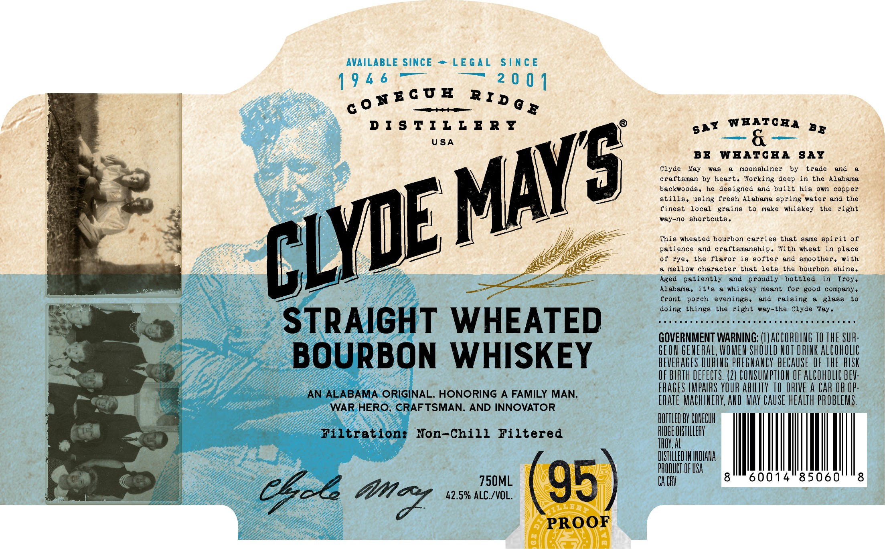

# TTB COLA Label Images - TTBID 26077001000451

**Brand Name:** CLYDE MAY'S

**Issue Date:** 03/31/2026

**Origin Code:** 10

**Product Class/Type:** 141

**Source:** [TTB Public COLA Registry](https://ttbonline.gov/colasonline/viewColaDetails.do?action=publicFormDisplay&ttbid=26077001000451)

## Label Images

### Label 1

### Label 2

### Label 3

## Extracted Label Text

*Text extracted via OCR - may contain errors*

*2 image(s) excluded: text did not meet readability threshold*

**Detected Proof:** 85

### Label 1

BLE

—

0

wECUE Ring,

DISTILLERY

gat igligp he ons By

=

USA

BE WHATCHA SAY

Clyde May was a moonshiner by trade and a

"ae

craftsman by heart. Working deep in the Alabama

backwoods, he designed and built his own copper

finest local grains to make whiskey the right

stills, using fresh Alabama spring water and the

y5

way-no shortcuts

This wheated bourbon carries that same spirit of

“4

patience and craftsmanship. With wheat in place

@ mellow character that lets the bourbon shine

of rye, the flavor is softer and smoother, with

yok

Aged patiently and proudly bottled in Troy

Alabama, it's a whiskey meant for good company

9

front porch evenings, and raising a glass to

doing things the right way-the Clyde Yay

ses a cee tesserae tee setesccessersesesse

Pony

STRAIGHT WHEATED

GOVERNMENT WARNING: (I) ACCORDING 10 THE SUR-

GEON GENERAL, WOMEN SHOULD NOT DRINK ALCOHOLIC

BOURBON WHISKEY

BEVERAGES DURING PREGNANCY BECAUSE OF THE RISK

OF BIRTH DEF

ERAGES [MPAIRS YOUR ABILITY 10 DRIVE A CAR OR OP

ECTS. (2) CONSUMPTION OF ALCOHOLIC BEV.

~~

AN ALABAMA. ORIGINAL, HONORING A FAMILY MAN

ERATE MACHINERY, AND MAY CAUSE HEALTH PROBLEMS.

WAR; HERO, CRAFTSMAN, AND INNOVATOR

ah

DOTTLED BY CONECUN

Filtration: Non-Chill Filtered

La ch TILLER

i ie ININDIANA

Lt FUSA

MITE,

pe

750ML

’

14°8506

then

42.5% ALC /VOL.

Chol Ligne

¥4

fe\t\\4
