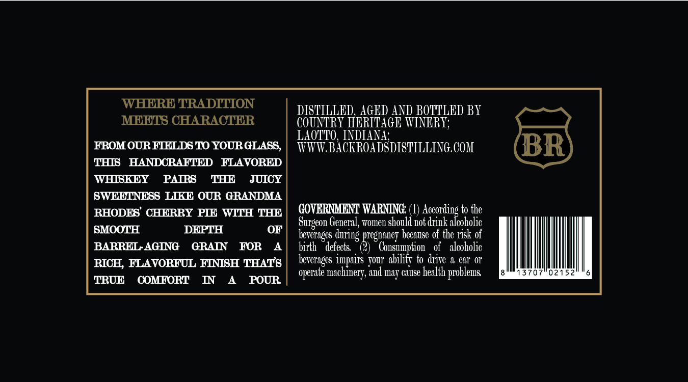

# TTB COLA Label Images - TTBID 26077001000489

**Brand Name:** BACKROADS DISTILLING COMPANY

**Fanciful Name:** GRANDMA RHODES' CHERRY PIE

**Issue Date:** 04/14/2026

**Origin Code:** 19

**Product Class/Type:** 149

**Source:** [TTB Public COLA Registry](https://ttbonline.gov/colasonline/viewColaDetails.do?action=publicFormDisplay&ttbid=26077001000489)

## Label Images

### Front Label

## Extracted Label Text

*Text extracted via OCR - may contain errors*

### Front Label

WHERE TRADITION
DISTILLED, AGED AND BOTTLED BY
MEHTS CHARACTER
COUNTRY HERITAGE WINERI;
LAOTTO, INDIANA'
FROM OUR FIELDS 70 YOURGLASS,
TTTTV BACIROADSDISTILLING, COI
BR
THIS
HANDCRAFTHD
FLAVORHD
WHISKEY
PAIRS
THE
JUICY
SWEELNESS LIKE OUR GRANDMA
RHODES' CHERRY PIE WITH THE
GOVBRNMENT WARNING:;
doroninkondhe
to the
General, woze1 should not diink
SMOOTH
DEPTH
OF
bererages during preguancy because of the xisk of
BARREL AGING
GRAIN
FOR
biith
'defects
Consumption
of   alcoholic
RICH; FLAVORFUL FINISH THATS
bererages impaits  Toui abilify to drive
a ca1' 01'
'machinerv, and
cause bealth pioblezs
13707"02152
TRUE
COMFORT
IN
POUR
Surgeon'
operate
may
