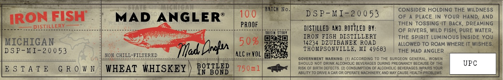

# TTB COLA Label Images - TTBID 26077001000503

**Brand Name:** IRON FISH DISTILLERY

**Issue Date:** 03/18/2026

**Origin Code:** 06

**Product Class/Type:** 140

**Source:** [TTB Public COLA Registry](https://ttbonline.gov/colasonline/viewColaDetails.do?action=publicFormDisplay&ttbid=26077001000503)

## Label Images

### Label 1

## Extracted Label Text

*Text extracted via OCR - may contain errors*

**Detected Proof:** 100

### Label 1

we oe

= SSL

TCH No

CONSIDER HOLDING THE WILDNESS

MAD ANGLER®

100

DSP-MI=20053

OF A PLACE IN YOUR HAND, AND

LAR

ON FISH

PROOF

|

THEN TOSSING “IT BACK, DREAMING

= DISTILLERY ——

aachentsnacalla

DISTILLED AND.BOTTLED BY

i

IRON FISH DISTILLERY

| OF RIVERS, WILD FISH, PURE WATER,

THE SPIRIT LUMINOUS |INSIDE YOU

MICHIGAN

14234 DZUIBANEK ROAD

50%

ALLOWED TO ROAM WHERE IT WISHES.

|

DSP-MI-20053

ad, ran

THOMPSONVILLE, MI 49683

| THE MAD ANGLER

é

NON CHILL-FILT

ED

ALC ey VOL) fajeiee

GOVERNMENT WARNING: (1) ACCORDING TO THE SURGEON GENERAL, WOMEN

SHOULD NOT DRINK ALCOHOLIC BEVERAGES DURING PREGNANCY BECAUSE OF THE

UPC

ABILITY TO DRIVE A CAR OR OPERATE MACHINERY, AND MAV CAUSE HEALTH PROBLEMS.

RISK OF BIRTH DEFECTS. (2) CONSUMPTION OF ALCOHOLIC BEVERAGES IMPAIRS YOUR

IBSTATE GROWN | WHEAT WHISKEY ) BOMTLED |750n1| <a
